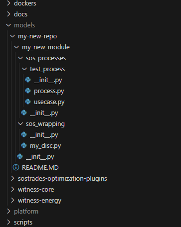

# Adding a Personal Repository to SoSTrades

Follow these steps to integrate a personal repository into your already installed SoSTrades local platform.

---

## Step 1: Clone Your Repository

Add your personal repository by cloning it into the following directory:
```
sostrades-dev-tools/models/<your-new-repository>
```

The repository must be a git repository, and have the following structure :


---

## Step 2: Update the Virtual Environment

1. Locate and open the file:
   ```
   ./sostrades-dev-tools/.venv/Lib/site-packages/sostrades.pth
   ```

2. Add the path to your repository at the end of the file:
   ```
   ./models/<your-new-repository>
   ```

---

## Step 3: Update the Platform Configuration

1. Locate and open the file:
   ```
   ./sostrades-dev-tools/platform/sostrades-webapi/sos_trades_api/configuration_template/configuration.json
   ```

2. Add your repository **module name** (e.g. the name you would use in python import) to the `SOS_TRADES_PROCESS_REPOSITORY` section:
   ```json
    "SOS_TRADES_PROCESS_REPOSITORY": [
        "sostrades_core.sos_processes",
        "sostrades_optimization_plugins.sos_processes",
        "climateeconomics.sos_processes",
        "energy_models.sos_processes",
        "<your-new-repository-module-name>.sos_processes"
    ],
   ```

---

## Step 4: Update VS Code Configuration

1. Open the file:
   ```
   ./sostrades-dev-tools/.vscode/settings.json
   ```

2. Add your repository to the `python.analysis.extraPaths` section:
   ```json
   "python.analysis.extraPaths": [
       "./platform/sostrades-core",
       "./platform/sostrades-ontology",
       "./platform/sostrades-webapi",
       "./platform/sostrades-webgui",
       "./models/sostrades-optimization-plugins",
       "./models/witness-core",
       "./models/witness-energy",
       "./models/<your-new-repository>"
   ]
   ```

---

## Step 5: Rebuild the Ontology (Optional)

If you want your new code to be reflected in the ontology, rebuild it using one of these methods:

### Local Installation
Run the following script from the `sostrades-dev-tools/` folder:
```
scripts/UpdateOntology.py
```

### Using Docker
Run the following command:
```
docker compose build ontology
```

---

## Step 5: Restart the API and Ontology

Restarting ensures your new repository is fully integrated into the platform.

### Local Installation
1. Close all open platformd terminals.
2. Restart the platform using the script:
   ```
   scripts/StartSoSTrades.py
   ```

### Using Docker
Run the following commands:
```
docker compose down
```
```
docker compose up
```

---

Your personal repository is now successfully added and operational within the SoSTrades platform.

