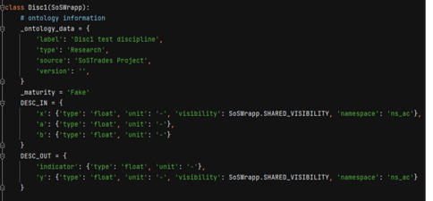
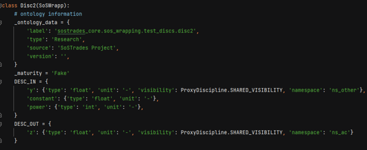
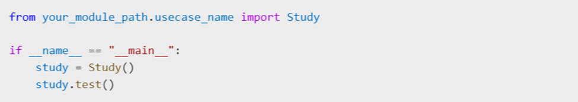

# Developer Manual

This documentation manual is designed for people looking to develop their own models, processes or studies in SoSTrades, leveraging all extended capabilities of its execution and configuration engine. 

SoSTrades is a web-based, multi-user, interactive publication-quality graph simulation platform. It allows users to drop new modules without additional coding, and provides embedded advanced numerical capabilities for simulation and multi-disciplinary optimization.

Learn how to create a wrapper for one of your Python model, define your I/O variables, create your post-processings, combine wrapper in processes, configure your own studies with SoSTrades capabilities.


## Chapter 1: Overall Introduction
TBD
### Section 1.1: What is SoSTrades ? 
explain gemseo 
explain that it comes with a GUI, refers to the user manual
explain all benefits to use sostrades (instead of gemseo)
### Section 1.2: SoSTrades main concepts
explain what is a model/wrapp/process/study 
explain what is a MDA/MDO/DOE ...
explain what is a namespace (theorically)


## Chapter 2: How to wrap your model in SoSTrades ?  
TBD
### Section 2.1: Input/output variables definition
TBD
### Section 2.2: Run method
TBD
### Section 2.3: Post-processing definition
TBD
### Section 2.4: Dynamic inputs/outputs
TBD

## Chapter 3 : How to create a process in SoSTrades
A process represents an ensemble of interconnected models.
In other multi-disciplinary applications, processes are defined manually with explicit interconnections, for instance in a script that calls several models sequentially, or graphically using a workflow editor.

In SoSTrades, model interdependencies are detected automatically on a variable-name basis using GEMSEO. Thus, process definition boils down to providing rules for the instantiation of wrapped models and the naming of their variables.
Any SoSTrades study is based on a single process (several studies can rely on the same process). A process can be included in another process, as a subprocess.

When a process is created, all its models’ inputs and outputs are assigned full names permitting their unique identification. This allows GEMSEO to infer the execution sequence required for their sensical evaluation.

### Section 3.1 Notion of namespaces
A namespace represents the location where a set of variables is stored within a process. 
Inputs and outputs as declared in the model wrapper define variables’ short names. When an instance of the model is added to a process, namespaces allow to uniquely identify variables as:

*Variable full name = namespace value . variable short name*

Two variables from different models with the same full name are considered as being the same, hence required to have the same value. In this manner, namespaces allow fine-grained control of the process couplings. 
Namespaces are also used to organize the data location on the SoSTrades GUI (treeview).

#### Local vs. Shared visibility
By default, a variable declared in a model wrapper is considered to have Local visibility. When an instance of this model is used in a process, the variable will be stored in its own local namespace.

**Example:** local variable “initial_population” is an input of “population” model. When used in a process by the model instance “MyStudy.France.population”, it will be assigned the full name “MyStudy.France.population.initial_population”.

If a variable is defined as having Shared visibility so that different models can use it, then it is necessary to assign a namespace field to its declaration in the model wrapper. This is the name of its namespace. 

**Example:** variable “GDP” (gross domestic product) is an input of both the “population” and “economics” models. In both wrappers it is declared with Shared visibility in namespace “ns_country”.

When the model is instantiated in a process, a value is assigned (implicitly or explicitly) to every namespace involved, defining variable full names.  

**Example:** by assigning “ns_country” to the value “MyStudy.France” upon model instantiation, both model instances “MyStudy.France.population” and “MyStudy.France.economics” will use the shared input “MyStudy.France.GDP”.

#### Basic usage
To couple two models, one will usually define the same shared namespace for the same variable in both wrappers. For example, to couple Disc1 and Disc2 via variables “y”, “z”:

 


On the other hand, if we want Disc1 and Disc2 to be independent (no coupling variables):

 



An analogous strategy is used to share inputs between models.

#### Namespace names and values
Every namespace has a name and a value. During the creation of a process (instantiation of the models), the value assigned to a certain name can change.
This duality allows the user to control which variables are coupled and which are not, especially in a process containing several instances of the same generic model.

•	Namespace name: defined in the I/O descriptor of the model wrapper for variables with Shared visibility (e.g. “ns_country”). 
•	Namespace value: generally defined at process creation (e.g. “MyStudy.France”).

Note that namespace names only provide a layer of abstraction for process creation. For a given SoSTrades study, namespace values alone will define the coupling structure and data organization (names are irrelevant). In this manner it is possible to:

•	Set two namespaces with different names to have the same value. Any variables with the same full name will be matched (even if Local visibility was declared).
•	Set a namespace name to take different values for different model instances, thus avoiding unwanted variable matches.

**Example:** model instances “MyStudy.France.population” and “MyStudy.France.economics” use input “MyStudy.France.GDP”. During process creation, the value of “ns_country” is updated from “MyStudy.France” to “MyStudy.Germany”, so that “MyStudy.Germany.population” and “MyStudy.Germany.economics” use input “MyStudy.Germany.GDP”. The data treeview of the study is organized as:

```
MyStudy
|_ France
    |_ population
    |_ economics
|_ Germany
    |_ population
    |_ economics
```

### Section 3.2 Notion of MDA to solve complex interactions
#### Execution sequence

The existence an input/output dependency between two models generates a coupling between them. This will alter the model execution sequence required for the sensical evaluation of the process: the model that computes an output needs to be executed before the model that is to take the value as input. 
The execution sequence of a process can be represented by a directed graph (using model instances as nodes and coupling variables as edges).
A coupling also alters the input/output structure of the process; a variable that is imposed by a model output is no longer required as input to evaluate the process. In other words, weak couplings are process outputs.

**Example:** execution sequence of weakly coupled process (only coupling variables shown)


#### MDA loop

A cycle in the execution sequence raises a particular situation: a given data point can represent a state of contradiction among the models involved. We refer to this as a strongly coupled problem. The sensical evaluation of the process requires to solve for an equilibrium point that respects the execution sequence. 
Multi-disciplinary analysis provides different formulations to convert such processes into optimization problems, which can be solved numerically to obtain sensical values for the strong couplings. Usually an initial guess is required, i.e. starting values for the strong couplings, not necessarily in equilibrium. In the general case, the initial guess can have an impact on the final output of the process. Hence strong couplings can be considered as both inputs and outputs to the process.

**Example:** execution sequence of strongly coupled process with MDA loop highlighted


#### Example 1: static aeroelasticity 

This famous, strongly coupled process represents the interaction between the aerodynamics model and the structure model, in the modeling of an aircraft wing subject to aerodynamic forces that produce in turn a change in the wing shape.


Implementation as a SoSTrades process requires the wrapped Aerodynamics model and Structure model, and the specification of namespaces that store their relevant shared variables. In this case, a single shared namespace is necessary (NS_Aeroelasticity).


#### Example 2: fleet aeroelasticity

This example illustrates how namespaces names and values allow fine-grained control of the process couplings, in a case where static aeroelasticity is to be modeled for several aircraft in a fleet.


This case requires distinguishing between NS_Public (same value for all models) and NS_Aeroelasticity (whose value changes from one aircraft to another).


**key points to remember**


### Section 3.3 Create a process 


#### Procedure to create a simple process connecting a set of models

1.	Create a submodule of sos_processes in your repository (with  `__init__.py` file). Its name will define the name of the process.
2.	Create also a process.py file that implements a class named ProcessBuilder(BaseProcessBuilder).
3.	_ontology_data attribute defines several fields for identification and GUI display.
4.	Define a method get_builders(self). It must return a list of builders with the rules to instantiate wrapped models. Implicitly or explicitly, values must be given to all namespaces declared in these builders. Interfaces to factory methods are provided to this purpose, the basic one is:

```
self.create_builder_list(mods_dict, ns_dict)
```

•	mods_dict: dictionary {model instance name : model wrapper module and class}. The model wrapper class is a SoSWrapp subclass (cf. [Section 2](## Chapter 2: How to wrap your model in SoSTrades ?)).
•	ns_dict: dictionary {namespace name : namespace value}, for all the shared namespaces to be used by the model instances.

An empty study can now be created on GUI, based on this process (cf. [Section 4](## Chapter 4 : How to create a Study in SoSTrades)).

#### Advanced process creation
**Example:** multi-scenario study using multi-instance driver.


•	Allows to replicate a subprocess N times, scenarios can be defined on GUI.
•	`self.ee.factory.get_builder_from_process` to obtain the subprocess builder from another process module.
•	Build map new_map is used to specify the namespaces that will not be replicated (but shared among the different instances of the subprocess). 
•	`self.ee.post_processing_manager.add_post_processing_module_to_namespace` to include post-processings in the study, other than the graphs and tables implemented in the model wrappers.


## Chapter 4 : How to create a Study in SoSTrades

#### Study vs. usecase

A SoSTrades Study represents the application of concrete input data to a process. Studies can be created, configured (modification of inputs) and run (computation of outputs) on the SoSTrades platform. 

After implementing the process, it is possible to create an empty Study from it directly on the platform. In this case the user needs to input all necessary data manually before executing the Study. 

A SoSTrades usecase is a script that pre-configures a Study with a given process plus a set of input data. All SoSTrades usecases are tested in the DevOps l1 step. Thus, usecases allow to:
•	Reduce the amount of manual input required for the execution of a Study.
•	Test the validity of a process before its execution on a web platform.

### Section 4.1 Create a usecase 

A usecase implements a process with a set of input data to run on this process. 
Here is a step-by-step on how to create a usecase:

1. File placement

To create a usecase for a specific process you need to add a new python file named `usecase.py` in the same directory as the `process.py` file of the desired process.
To create several usecases of the same usecase you can create different usecase python files, but you need to name them starting with *usecase*.
Here is an example of a process directory content:
```
-	my_process_folder
    __init__.py
	process.py
	usecase_with_data1.py
	usecase_with_data2.py
```

2. Completing the usecase
The new usecase.py will define a Study class that inherits from StudyManager class.
You can implement the `setup_usecase()` method to define the data associated with the usecase. 
This method returns a dictionary or list of dictionaries with the usecase inputs you want to define. 
The keys of the dictionary are the namespace followed by the name of the data and separated by points.

**Example:**


### Section 4.2 : Test and validate your study

Once the usecase is created, you can create a study to check that it is correctly defined.
A study is an instance of a usecase. A study can also be empty, it will represent the process with no inputs. An empty study can be created and then edited directly on the Sostrades website.
To create a study from a usecase, you can use one of the two methods below:

#### Method 1: Using a Script

This method is recommended to be used first to test your usecase.
1.	Declare an instance of the Study class in your script.
2.	Call the `load_data()` method on the instance. This method will invoke the `setup_usecase()` method written in the `usecase*.py` file to populate the necessary data. To find all the data and their namespaces you can use the `display_treeview_nodes()` method with the  `display_variables` argument at True (see the example below).
3.	If you want the usecase to be filled with all the necessary data to be executed you can test that you have all the needed data by executing the study by calling the `run()` method. If necessary data are missing it will return an error describing the missing data.
4.	You can also test your usecase with the method `test()`, it will check the configuration and the data integrity, its runs twice to see that it reproduces the same results and all post-processing linked to the use case (the one in all the wrapp of the associated process) are validated . 


Or just to test:



5.	You can visualize the post processings of your usecase. A dedicated factory (PostprocessingFactory) manages post-processing functionalities within the SoSTrades platform. Users have the option to preview all post-processings created for their usecase (in all the wrapp of the associated process but also at a given node, see how to create-postprocessing for mroe details) with these commands :


The `show` method will open a window in your preferred web browser for each post-processing graph associated with the use case. There may be variations in typographies or policies compared to the SoSTrades GUI rendering.

#### Method 2: Using the Graphical Interface

1.	Ensure the usecase is correctly created. If so, it will appear in the list of references on the site.


2.	Generate the reference from the site. The reference will load the data of the usecase and it will run it (unless it is declared to not do so).


3.	Create an instance of the usecase via the interface.


 
4.	After the creation, the study is opened. In the Data tab, you will find the inputs and outputs of the study. The study has already run so it is in read only mode.


5.	You can switch in edition mode and modify the inputs if needed or execute the study directly from the graphical interface.
Method 3: Create empty study in the graphical interface

#### Method 3: Create empty study in the graphical interface
1.	On the Study Management page of the Sostrades website, click on the “Create study”, select the desired process and let the reference to “Empty Study”.


 
2.	The study is created with no data, you can modify the inputs and execute the study.

By following these methods, you can efficiently create and execute studies based on your usecases.

**Key Points to Remember:**


## Chapter 5 : How to create your own repository ? 
Please follow the [add a new repository](add-repository.md) page to add new repositories.

1. Create a new repository
   - Create a new repository on GitHub
   - Follow SoSTrades naming conventions for consistency

2. Configure the Acess Management
Add the following groups with admin role:
- Business For Planet Modeling - Devops
- Business For Planet Modeling - Core developer
- Business For Planet Modeling - Repository admin

3. Branch Structure
Your repository must include these mandatory branches:
- `develop`: Main development branch
- `integration`: Testing branch for deployed integration platform
- `post_integration`: Pre-validation branch, this platform is used for tests pipeline before merge into validation
- `validation`:  For validation platform where all tests are validated
- `main`: Release branch

4. Development Workflow
- Development starts on `develop` branch
- Then merge the develop into integration
- Automatic pipeline handles merges through branches
- Flow: integration → post_integration → validation → main

### Section 5.1: Repository structure

```
New_repo_name

    new_repo_name
        datasets_database
            datasets
            mappings
        models
            __init__.py
        sos_process
            __init__.py
        tests
            __init__.py
        __init__.py
    .coveragerc
    .gitignore
    LICENSE
    platform_version_required.txt
    pytest
    README.md
    requirements.in
```
 
### Section 5.2: Connect your repository to your GUI
- If you use the local installation with sostrades-dev-tools:
  1. Locate `sostrades-dev-tools\model_repositories.json`
  2. Add your GitHub repository URL inside this file

