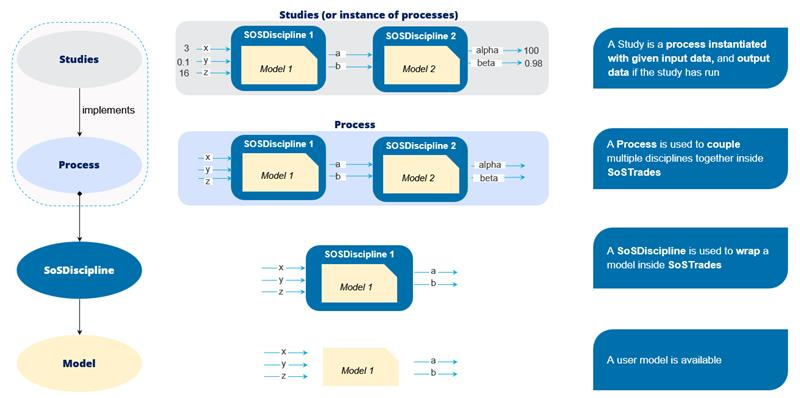
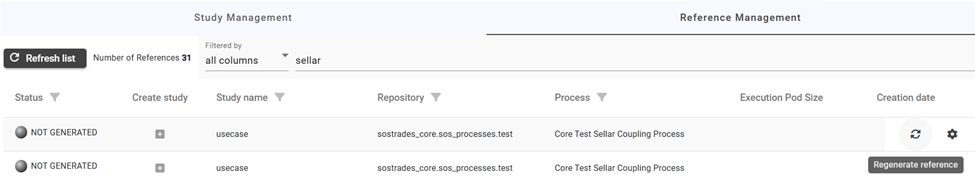
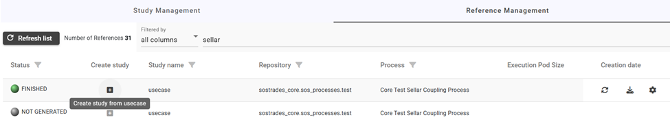
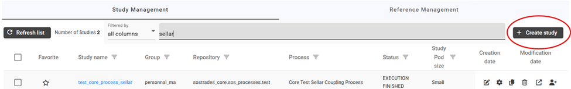
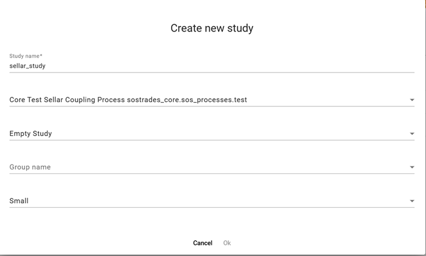

# Developer Manual

This documentation manual is designed for people looking to develop their own models, processes or studies in SoSTrades, leveraging all extended capabilities of its execution and configuration engine. 

SoSTrades is a web-based, multi-user, interactive publication-quality graph simulation platform. It allows users to drop new modules without additional coding, and provides embedded advanced numerical capabilities for simulation and multi-disciplinary optimization.

Learn how to create a wrapper for one of your Python model, define your I/O variables, create your post-processings, combine wrapper in processes, configure your own studies with SoSTrades capabilities.


## Chapter 1: Overall Introduction

### Section 1.1: What is SoSTrades ? 

SoSTrades is a generic simulation platform whose main purpose is to load, connect and execute different kinds of Python models, thus allowing to conduct studies based on these models (by adding concrete input data).

As a collaborative web and cloud-based platform, it particularly facilitates the inter-disciplinary simulation process by permitting cooperative scenario creation, with high security, scalability and data traceability standards. In other words, once the models are loaded and interconnected, several experts in a team can simultaneously edit the data in a study and/or analyze its results without having to worry about backups, logs or secure data sharing. Hence SoSTrades can also be seen as a concurrent design framework.

From an engineering perspective, SoSTrades is a multi-disciplinary optimization platform. As such, it is based on the open-source library GEMSEO. 
This scientific library provides advanced mathematical machinery to solve the numerical problems that arise when computing complex interactions between interdependent models. SoSTrades provides a user-friendly interface to most GEMSEO capabilities. 

A key feature of GEMSEO is its semantic layer, which automatically detects how the models are connected from their input/output declarations, on a variable name basis. When these interdependencies are not straightforward, a sequential execution of the ensemble of models is not possible. An arbitrary set of model inputs could be non-sensical system-wise, representing contradictions between the different models. In these cases, an iterative resolution is necessary to find an “equilibrium point” of the system, even for a simple simulation. GEMSEO provides multi-disciplinary analysis algorithms that allow to conduct such simulations, an additional layer of optimization and vast tooling for visualization, design of experiments, meta-modeling, parallel execution and post-processing, among other. The level of automation provided by GEMSEO is particularly useful in cases where a high number of strongly interconnected models are considered.


### Section 1.2: SoSTrades main concepts
#### Model, wrapper, process and study
- *Model*: mathematical artifact that performs computations on some input variables to produce output variables, generally with the purpose of simulating a real-world phenomenon or process. SoSTrades can handle generic models provided that they are represented by a python program.
- *Wrapper*: method or object that acts as a high-level interface to another method of object. With minimal or no modification of the latter, it allows its usage in another environment. SoSTrades requires the wrapping of generic python models for their execution on the platform, and in particular the declaration of all their inputs and outputs, with their types. This is conducted via the interface provided by SoSWrapp (cf. [Chapter 2](#chapter-2-how-to-wrap-your-model-in-sostrades-)).  
- *Process*: a SoSTrades process is an ensemble of model instances, whose inputs and outputs are uniquely identified by variable names, imposing input/output interactions between them. These relationships allow to distinguish between inputs, outputs and coupling variables of the process as a whole. A process constitutes a sort of “evaluation function” in SoSTrades.
- *Study*: a SoSTrades study represents the application of a process to a set of concrete input data (including numerical options), allowing the computation of its outputs for this set of inputs. Once the study is configured with all required inputs, it can be run to produce outputs.



#### Inputs, outputs and couplings
In a process with two or more interdependent models, each of the models’ variables falls into at least one of the categories below:
- *Input*: independent variable that needs to be provided externally to a model to be used in the computations.
- *Output*: dependent variable that is produced by one of the models via computations that rely on inputs. A single output variable cannot be produced by two or more models (otherwise its value would be ambiguous).
- *Coupling variables*: in a process with several models, a single variable x can simultaneously be the output of model A and the input of model B. 
Then models A and B are coupled, and x is a coupling variable.
  - *Weak couplings*: in a weakly coupled process there is an ordering of the models that allows the sensical resolution of the system with at most one execution of each model, in a cascade fashion. In the example above, it suffices to evaluate A before B. Coupling variables which are only involved in weakly coupled subprocesses are referred to as weak couplings.
  - *Strong couplings*: when no permutation of the order of model execution allows to compute all outputs assuring lack of contradiction, the process is strongly coupled (cf. [Section 3.2](#section-32--notion-of-mda-to-solve-complex-interactions)). Variables whose values are constrained by the input/ouptut logic are referred to as strong couplings. 
If in the example above we further assume that variable y is an output of B and an input of A, then both x and y become strong couplings. Executing A(x=x0) might lead to y=y1 such that B(y=y1) outputs x = x1 != x0. In which case input x=x0 represents a state of contradiction of the system. 

**Quick start elements**
Any new computation to be conducted on the SoSTrades platform requires the three elements below:
1.	A set of wrapped models with named inputs and outputs (cf. [Chapter 2](#chapter-2-how-to-wrap-your-model-in-sostrades-)).
2.	A process definition file, representing a set of interconnected instances of the models (cf. [Chapter 3](#chapter-3--how-to-create-a-process-in-sostrades)).
3.	A study, representing the application of a concrete set of input data to the process, which can be edited and run on the SoSTrades platform (cf. [Chapter 4](#chapter-4--how-to-create-a-study-in-sostrades)).


## Chapter 2: How to wrap your model in SoSTrades ?  
I want to use my Python model in SoSTrades platform.
To achieve this, I need to:
- Wrap a model
- Create a postprocessing for the model results
- Test my model to be able to contribute
- Create a Process using my model
- Create a Usecase to define input data for my study

A SosWrapp is a model wrapper for a SoSTrades application, i.e. your custom model wrappers need to inherit from this class.
Here is the minimal working example of a SoSWrapp :

```
from sostrades_core.execution_engine.sos_wrapp import SoSWrapp
from sostrades_core.tools.post_processing.charts.two_axes_instanciated_chart import InstanciatedSeries, \
    TwoAxesInstanciatedChart
from sostrades_core.tools.post_processing.charts.chart_filter import ChartFilter

class MyCustomWrap(SoSWrapp):
    # Ontology information
    _ontology_data = {
        'label': 'Label of the wrapp',
        'type': 'Research',
        'source': 'SoSTrades Project',
        'version': '',
    }

    # Description of inputs
    DESC_IN = {
        'x': {'type': 'float', 'default': 10, 'unit': 'year', 'namespace': 'ns_one'},
        'a': {'type': 'float', 'unit': '-', 'namespace': 'ns_one'},
        'b': {'type': 'float', 'unit': '-',},
    }

    # Description of outputs
    DESC_OUT = {
        'y': {'type': 'float', 'namespace': 'ns_one'}
    }

    # Method that runs the model
    def run(self):
        """
        Method that runs the model
        """
        # get input of discipline
        param_in = self.get_sosdisc_inputs()

        # performs the "computation"
        x = param_in['x']
        a = param_in['a']
        b = param_in['b']

        y = a * x + b

        output_values = {'y': y}

        # store data
        self.store_sos_outputs_values(output_values)
```

### Base class
SoSWrapp is the template class which all model wrappers inherit from (when using ‘SoSTrades’ wrapping mode).
It contains necessary information for the discipline configuration. It is owned by both the DisciplineWrapp and the SoSDiscipline.
Its methods `setup_sos_disciplines`, `run`, etc. are overloaded by the user-provided wrapper.

**N.B.**: `setup_sos_disciplines` needs take as argument the proxy and call `proxy.add_inputs()` and/or `proxy.add_outputs()`, for the definition of dynamic i/o (cf. Section 2.4).

**Attributes**:
- sos_name (string): name of the discipline as defined upon its inclusion in the process. 
- local_data (Dict[Any]): inputs and outputs of the model last run.
- local_data_short_name (Dict[Dict]): short name version of the local_data, for internal model usage (cf. Section 3.1).

### Ontology data
The ontology data specify all data regarding your SoSWrapp including :
- `label` : Name of the wrapper on the ontology panel of the SoSTrades platform
- `type` : Type of the model ‘Research’, ‘Industrial’ or ‘Other’
- `source` : the person or project that has implemented the wrapper AND the model behind it
- `version` : A version of the model if necessary

### Section 2.1: Input/output variables definition
The DESC_IN and DESC_OUT dictionaries are the input and output variable descriptors. It gives information on variables in the wrapper used by the model.

```
DESC_IN = {
    'x': {'type': 'float', 'default': 10, 'unit': 'year', 'namespace': 'ns_one'},
    'a': {'type': 'float', 'unit': '-', 'namespace': 'ns_one'},
    'b': {'type': 'float', 'unit': '-',},
}
DESC_OUT = {
    'y': {'type': 'float', 'namespace': 'ns_one'}
}
```

- `type` : mandatory could be : `'float'`, `'int'`, `'dict'`, `'dataframe'`, `'bool'`
- `subtype_descriptor` (or `dataframe_descriptor`) : if the variable is a dict/list (or dataframe), gives the types (or descriptor) of the sub-elements (or columns). See next sections
- `default` : if the variable has a default value. The default must be the same type as the type
- `unit` : (string) unity of the variable used for the ontology
- `namespace` : must be identified by a string name, and its value must be defined within the process utilizing the wrapp. This feature allows for parameterizing the variable’s location based on the specific process.
- `user_level` : Specify the display level in the GUI: 1 for Standard view, 2 for Advanced, and 3 for Expert. If a variable is assigned an expert user level, it will only be visible in the expert view. This feature is useful for concealing complex variables that may be challenging to define. By default the display levvel is 1.
- `range` : for float or int, range of the variable. the range will be checked by a data integrity method
- `possible_values` : for string, possible values list of the variable. the possible values will be checked by a data integrity method
- `optional` : A boolean flag that makes a variable optional to fill in the GUI
- `editable` : A boolean flag that makes a variable editable or not in the GUI. By default input and coupling variables are editable, outputs are not.
- `structuring` : A boolean flag that that defines a structuring variable, indicating its impact on the configuration of the wrapper or other variables of the process. For instance, it may be used for an assumption flag, and when activated, it creates new variables (cf. Section 2.4).

#### Dataframe descriptor
Here is an example dataframe descriptor. For each column you declare a tuple which defines:
1. the type of the values in the column,
2. the range (for int or float) or possible values (for string), None if nothing is specified
3. whether the column is editable in the GUI or not.

```
TransportChoiceData = {
    "var_name": "transport_choice",
    "type": "dataframe",
    "dataframe_descriptor" : {
        Years : ('int', YearsBoundaries, True),
        ProductName : ('string', None, True),
        TypeName : ('string', TransportPossibleValues, True),
        PercentageName : ('float', None, True),
    }
}
```

#### Subtype descriptor for dicts
Here is an example of dict subtype descriptors. You can define an infinite depth for dictionaries and the type at the lower level will be checked.

```
"dict_of_dict_in" : {"type": "dict", ProxyDiscipline.SUBTYPE: {"dict": {"dict": "float"}}, "user_level": 1}
"dict_of_dataframe_in" : {"type": "dict", ProxyDiscipline.SUBTYPE: {"dict": {"dataframe"}}, "user_level": 1}
```

### Section 2.2: Run method

```
    # Method that runs the model
    def run(self):
        """
        Method that runs the model
        """
        # get input of discipline
        param_in = self.get_sosdisc_inputs()

        # performs the "computation"
        x = param_in['x']
        a = param_in['a']
        b = param_in['b']

        y = a * x + b

        output_values = {'y': y}

        # store data
        self.store_sos_outputs_values(output_values)
```

- The function `get_sosdisc_inputs(variable name)` returns the value of the variable in the data manager. It can be used without arguments, in this case it returns a dict with all keys and values of the DESC_IN.
- The core computations of the model can be implemented here or loaded from an external model
- Output values are stored in a dictionary {variable_name : value} with the value coming from the model
- The dictionary is sent to the data manager with the function  `store_sos_output_values(dict_values)`

### Section 2.3: Post-processing definition
In SoSTrades charts can be displayed. They need to be implemented in the SOSWrapp.
Two methods need to be implemented for post-processings.

#### get_chart_filter_list

```
SoSWrapp.get_chart_filter_list()
```

This method is used to make the list of available filters. It returns a list of `ChartFilter` instance base on the inherited class post processing filtering capabilities.


Here is how `ChartFilter` is defined :

```
classsostrades_core.tools.post_processing.charts.chart_filter.ChartFilter(name='', filter_values: list = [], selected_values: list = [], filter_key=None, multiple_selection=True)
```

Parameters:
- name : string that contains filter name
- filter_values : list of filter items that can be used to filter post processing element
- selected_values : list of filter items currently selected for the given filter
- filter_key : unique key used to identify the current filter

#### get_post_processing_list

```
SoSWrapp.get_post_processing_list(filters=None)
```

This method builds the post processings charts and returns a list of post processing instance using the `ChartFilter` list given as parameter, to be overload in subclasses.

Parameters:
filters (ChartFilter[]) – filter to apply during post processing making

`get_post_processing_list` conditionally generates the instances of the post processing objects depending on the filters’ selected values

Remember that this method should not make any heavy computation so graph data should be processed by the model in the discipline run and stored in output variables if need be

We can create a plotly figure (in the example a table). We then call the method InstantiatedPlotlyChart(plotly_figure). This returned chart is then used as in the previous example.

#### TwoAxesInstanciatedChart

Here is an example to make a simple chart

```
def get_post_processing_list(self, chart_filters=None):
    """
    Gets the charts selected
    """
    instanciated_charts = []
    chart_list = []

    # Overload default value with chart filter
    if chart_filters is not None:
        for chart_filter in chart_filters:
            if chart_filter.filter_key == 'charts':
                chart_list = chart_filter.selected_values

    if 'sample chart' in chart_list:
        # Get the values
        x = self.get_sosdisc_inputs('x')
        y = self.get_sosdisc_inputs('y')

        # Instanciate chart
        new_chart = TwoAxesInstanciatedChart('x (-)', 'y (-)', chart_name="x vs y")

        # Add data points
        serie = InstanciatedSeries([x], [y], series_name="x vs y", display_type='scatter')

        new_chart.series.append(serie)

        instanciated_charts.append(new_chart)

    return instanciated_charts
```

#### InstantiatedPlotlyChart
 You can use `InstantiatedPlotlyChart` to use a plotly figure already created.

### Section 2.4: Dynamic inputs/outputs
Sometimes the input or output variable declarations depend on the value of another input variable.
This kind of *dynamic* i/o need to be declared during the configuration phase. 
The input variables on which they depend need to be declared as *structuring*.

```
def setup_sos_disciplines(self):
        dynamic_inputs = {}
        if 'Model_Type' in self.get_data_in():
            Model_Type = self.get_sosdisc_inputs('Model_Type')
            if Model_Type == 'Affine':
                dynamic_inputs.update({'b': {'type': 'float',
                                             'namespace': 'ns_b'}})
            elif Model_Type == 'Polynomial':
                dynamic_inputs.update(
                    {'b': {'type': 'float', 'namespace': 'ns_b'}})
                dynamic_inputs.update({'power': {'type': 'float', 'default': 2., 'namespace': 'ns_ac'}})
        self.add_inputs(dynamic_inputs)
```

In this example, the variable `Model_Type` is a structuring input that define how the dynamic input `b` and `power` are declared.
The dictionnary of the dynamic variables is then added to the inputs with the function `add_inputs`.

The same thing can be done for outputs declaration and added to the outputs variables with the function `add_outputs`.

NB: To make a default value for a variable effective, it must be updated using a specific function within
setup_sos_disciplines. You need to use the update_default_variable function for this. Setting it directly via the
add_inputs method will not work by design.

### Section 2.5 Test a SOSWrapp

#### Test file
Tests files should be created in the `tests/` directory.

The test naming convention is `l0_test_xx_test.py`

#### Test file content
Test file content is the same as regular tests.

#### Test method
Test method naming convention is test_xx_*
Usually tested features are :
- Build/configure
- Dynamic configuration
- Repeated configuration
- Execution success
- Execution correctness
- Post-processing beauty
…

**Example test**
```
import logging
import unittest

from sostrades_core.execution_engine.execution_engine import ExecutionEngine


class MyCustomWrapTest(unittest.TestCase):
    def setUp(self):
        self.name = 'MyCustomWrapTest'
        self.ee = ExecutionEngine(self.name)
        self.wrap_name = "MyCustomWrap"
        self.wrap_path = f"sostrades_core.sos_wrapping.tuto_wrap.my_custom_wrap.{self.wrap_name}"

    def test_01_wrap_execution(self):
        # Get the wrap builder
        wrap_builder = self.ee.factory.get_builder_from_module(self.wrap_name, self.wrap_path )

        # Set it to be built directly under the root coupling node
        self.ee.factory.set_builders_to_coupling_builder(wrap_builder)

        # associate namespaces
        self.ee.ns_manager.add_ns('ns_one', self.name)

        # Configure the discipline
        self.ee.configure()

        # Display the treeview
        logging.info(self.ee.display_treeview_nodes(display_variables=True))

        a, b, x = 1.0, 2.0, 1.0
        values_dict = {
            self.name + ".x": a,
            self.name + ".MyCustomWrap.a": b,
            self.name + ".MyCustomWrap.b": x,
        }

        # Load input values for the study
        self.ee.load_study_from_input_dict(values_dict)

        # Execute
        self.ee.execute()

        # Check status
        for disc_id in self.ee.dm.disciplines_dict.keys():
            self.assertEqual(self.ee.dm.get_discipline(disc_id).status, 'DONE')

        # Check output
        y = self.ee.dm.get_value(self.name + ".y")
        self.assertEqual(y, a * x + b)
```

## Chapter 3 : How to create a process in SoSTrades
A process represents an ensemble of interconnected models.
In other multi-disciplinary applications, processes are defined manually with explicit interconnections, for instance in a script that calls several models sequentially, or graphically using a workflow editor.

In SoSTrades, model interdependencies are detected automatically on a variable-name basis using GEMSEO. Thus, process definition boils down to providing rules for the instantiation of wrapped models and the naming of their variables.
Any SoSTrades study is based on a single process (several studies can rely on the same process). A process can be included in another process, as a subprocess.

When a process is created, all its models’ inputs and outputs are assigned full names permitting their unique identification. This allows GEMSEO to infer the execution sequence required for their sensical evaluation.

### Section 3.1 : Notion of namespaces
A namespace represents the location where a set of variables is stored within a process. 
Inputs and outputs as declared in the model wrapper define variables’ short names. When an instance of the model is added to a process, namespaces allow to uniquely identify variables as:

*Variable full name = namespace value . variable short name*

Two variables from different models with the same full name are considered as being the same, hence required to have the same value. In this manner, namespaces allow fine-grained control of the process couplings. 
Namespaces are also used to organize the data location on the SoSTrades GUI (treeview).

By default, a variable declared in a model wrapper is stored in the local namespace of the model instance.

**Example:**
local variable “initial_population” is an input of “population” model. When used in a process by the model instance “MyStudy.France.population”, it will be assigned the full name “MyStudy.France.population.initial_population”.

If a namespace parameter is specified when declaring a variable so that different models can use it, then th evariable
will be stored in this namespace (this the name of its namespace).

**Example:**
variable “GDP” (gross domestic product) is an input of both the “population” and “economics” models. In both wrappers it
is declared with the namespace “ns_country”.

When the model is instantiated in a process, a value is assigned (implicitly or explicitly) to every namespace involved, defining variable full names.  

**Example:** 
by assigning “ns_country” to the value “MyStudy.France” upon model instantiation, both model instances “MyStudy.France.population” and “MyStudy.France.economics” will use the shared input “MyStudy.France.GDP”.

#### Basic usage
To couple two models, one will usually define the same shared namespace for the same variable in both wrappers. For example, to couple Disc1 and Disc2 via variables “y”, “z”:

 


On the other hand, if we want Disc1 and Disc2 to be independent (no coupling variables):

 


An analogous strategy is used to share inputs between models.

#### Namespace names and values
In practice, every namespace has a name and a value. During the creation of a process (instantiation of the models), the value assigned to a certain name can change.
This duality allows the user to control which variables are coupled and which are not, especially in a process containing several instances of the same generic model.

- Namespace name: defined in the I/O descriptor of the model wrapper for variables (e.g. “ns_country”).
-	Namespace value: generally defined at process creation (e.g. “MyStudy.France”).

Note that namespace names only provide a layer of abstraction for process creation. For a given SoSTrades study, namespace values alone will define the coupling structure and data organization (names are irrelevant). In this manner it is possible to:

- Set two namespaces with different names to have the same value. Any variables with the same full name will be
  matched (even if one is declared without namespace).
-	Set a namespace name to take different values for different model instances, thus avoiding unwanted variable matches.

**Example:** model instances “MyStudy.France.population” and “MyStudy.France.economics” use input “MyStudy.France.GDP”. During process creation, the value of “ns_country” is updated from “MyStudy.France” to “MyStudy.Germany”, so that “MyStudy.Germany.population” and “MyStudy.Germany.economics” use input “MyStudy.Germany.GDP”. The data treeview of the study is organized as:

```
MyStudy
|_ France
    |_ population
    |_ economics
|_ Germany
    |_ population
    |_ economics
```

### Section 3.2 : Notion of MDA to solve complex interactions

#### Execution sequence

The existence an input/output dependency between two models generates a coupling between them. This will alter the model execution sequence required for the sensical evaluation of the process: the model that computes an output needs to be executed before the model that is to take the value as input. 
The execution sequence of a process can be represented by a directed graph (using model instances as nodes and coupling variables as edges).
A coupling also alters the input/output structure of the process; a variable that is imposed by a model output is no longer required as input to evaluate the process. In other words, weak couplings are process outputs.

**Example:** execution sequence of weakly coupled process (only coupling variables shown)


#### MDA loop

A cycle in the execution sequence raises a particular situation: a given data point can represent a state of contradiction among the models involved. We refer to this as a strongly coupled problem. The sensical evaluation of the process requires to solve for an equilibrium point that respects the execution sequence. 
Multi-disciplinary analysis provides different formulations to convert such processes into optimization problems, which can be solved numerically to obtain sensical values for the strong couplings. Usually an initial guess is required, i.e. starting values for the strong couplings, not necessarily in equilibrium. In the general case, the initial guess can have an impact on the final output of the process. Hence strong couplings can be considered as both inputs and outputs to the process.

**Example:** execution sequence of strongly coupled process with MDA loop highlighted


#### Example 1: static aeroelasticity 

This famous, strongly coupled process represents the interaction between the aerodynamics model and the structure model, in the modeling of an aircraft wing subject to aerodynamic forces that produce in turn a change in the wing shape.


Implementation as a SoSTrades process requires the wrapped Aerodynamics model and Structure model, and the specification of namespaces that store their relevant shared variables. In this case, a single shared namespace is necessary (NS_Aeroelasticity).


#### Example 2: fleet aeroelasticity

This example illustrates how namespaces names and values allow fine-grained control of the process couplings, in a case where static aeroelasticity is to be modeled for several aircraft in a fleet.


This case requires distinguishing between NS_Public (same value for all models) and NS_Aeroelasticity (whose value changes from one aircraft to another).


### **Key Points to Remember**


### Section 3.3 : Create a process 


#### Procedure to create a simple process connecting a set of models

1.	Create a submodule of sos_processes in your repository (with  `__init__.py` file). Its name will define the name of the process.
2.	Create also a process.py file that implements a class named ProcessBuilder(BaseProcessBuilder).
3.	_ontology_data attribute defines several fields for identification and GUI display.
4.	Define a method get_builders(self). It must return a list of builders with the rules to instantiate wrapped models. Implicitly or explicitly, values must be given to all namespaces declared in these builders. Interfaces to factory methods are provided to this purpose, the basic one is:

```
self.create_builder_list(mods_dict, ns_dict)
```

-	mods_dict: dictionary {model instance name : model wrapper module and class}. The model wrapper class is a SoSWrapp subclass (cf. [Section 2](#chapter-2-how-to-wrap-your-model-in-sostrades-)).
-	ns_dict: dictionary {namespace name : namespace value}, for all the shared namespaces to be used by the model instances.

An empty study can now be created on GUI, based on this process (cf. [Section 4](#chapter-4--how-to-create-a-study-in-sostrades)).

#### Advanced process creation
**Example:** multi-scenario study using multi-instance driver.


-	Allows to replicate a subprocess N times, scenarios can be defined on GUI.
-	`self.ee.factory.get_builder_from_process` to obtain the subprocess builder from another process module.
-	Build map new_map is used to specify the namespaces that will not be replicated (but shared among the different instances of the subprocess). 
-	`self.ee.post_processing_manager.add_post_processing_module_to_namespace` to include post-processings in the study, other than the graphs and tables implemented in the model wrappers.


## Chapter 4 : How to create a Study in SoSTrades

### Study vs. usecase

A SoSTrades Study represents the application of concrete input data to a process. Studies can be created, configured (modification of inputs) and run (computation of outputs) on the SoSTrades platform. 

After implementing the process, it is possible to create an empty Study from it directly on the platform. In this case the user needs to input all necessary data manually before executing the Study. 

A SoSTrades usecase is a script that pre-configures a Study with a given process plus a set of input data. All SoSTrades usecases are tested in the DevOps l1 step. Thus, usecases allow to:

-	Reduce the amount of manual input required for the execution of a Study.
-	Test the validity of a process before its execution on a web platform.

### Section 4.1 : Create a usecase 

A usecase implements a process with a set of input data to run on this process. 
Here is a step-by-step on how to create a usecase:

1. File placement

To create a usecase for a specific process you need to add a new python file named `usecase.py` in the same directory as the `process.py` file of the desired process.
To create several usecases of the same usecase you can create different usecase python files, but you need to name them starting with *usecase*.
Here is an example of a process directory content:
```
my_process_folder
    __init__.py
	process.py
	usecase_with_data1.py
	usecase_with_data2.py
```

2. Completing the usecase

The new usecase.py will define a Study class that inherits from StudyManager class.
You can implement the `setup_usecase()` method to define the data associated with the usecase. 
This method returns a dictionary or list of dictionaries with the usecase inputs you want to define. 
The keys of the dictionary are the namespace followed by the name of the data and separated by points.

**Example:**


### Section 4.2 : Test and validate your study

Once the usecase is created, you can create a study to check that it is correctly defined.
A study is an instance of a usecase. A study can also be empty, it will represent the process with no inputs. An empty study can be created and then edited directly on the Sostrades platform.
To create a study from a usecase, you can use one of the two methods below:

#### Method 1: Using a Script

This method is recommended to be used first to test your usecase.
1.	Declare an instance of the Study class in your script.
2.	Call the `load_data()` method on the instance. This method will invoke the `setup_usecase()` method written in the `usecase*.py` file to populate the necessary data. To find all the data and their namespaces you can use the `display_treeview_nodes()` method with the  `display_variables` argument at True (see the example below).
3.	If you want the usecase to be filled with all the necessary data to be executed you can test that you have all the needed data by executing the study by calling the `run()` method. If necessary data are missing it will return an error describing the missing data.
4.	You can also test your usecase with the method `test()`, it will check the configuration and the data integrity, its runs twice to see that it reproduces the same results and all post-processing linked to the use case (the one in all the wrapper of the associated process) are validated . 


Or just to test:


5.	You can visualize the post processings of your usecase. A dedicated factory (PostprocessingFactory) manages post-processing functionalities within the SoSTrades platform. Users have the option to preview all post-processings created for their usecase (in all the wrapper of the associated process but also at a given node, see how to create-postprocessing for mroe details) with these commands :


The `show` method will open a window in your preferred web browser for each post-processing graph associated with the use case. There may be variations in typographies or policies compared to the SoSTrades GUI rendering.

#### Method 2: Using the Graphical Interface

1.	Ensure the usecase is correctly created. If so, it will appear in the list of references on the site.


2.	Generate the reference from the site. The reference will load the data of the usecase and it will run it (unless it is declared to not do so).




3.	Create an instance of the usecase via the interface.




 

4.	After the creation, the study is opened. In the Data tab, you will find the inputs and outputs of the study. The study has already run so it is in read only mode.


5.	You can switch in edition mode and modify the inputs if needed or execute the study directly from the graphical interface.


#### Method 3: Create empty study in the graphical interface
1.	On the Study Management page of the Sostrades website, click on the “Create study”, select the desired process and let the reference to “Empty Study”.





 
2.	The study is created with no data, you can modify the inputs and execute the study.

By following these methods, you can efficiently create and execute studies based on your usecases.


## Chapter 5 : How to plug your own repository to the platform

This section explains the procedure to include a repository of choice in the SoSTrades platform.
This is the procedure to follow when adding a new models repository, for instance.

### Section 5.1 : Repository structure

The repository must be a git repository, and have the following structure:


1. The main module folder

The repository must contain a main folder for the repository main python module.
This folder MUST contain an `__init__.py` file.
More generally, <span style="color: red;">each python module must contain an `__init__.py` file.</span>


2. The processes module

The processes and usecases need to be in a module named `sos_processes`.
Each process needs to have its folder named with the name of the process. 

A process name should be :
- without space
- without special caracters
- words separated by underscores '_'

The folder of a process contains :
- an `__init__.py` file.
- a `process.py` file that contains the ProcessBuilder class of the process.
- any number of usecase files named starting with 'usecase_'.
- if the process has a specific documentation, the documentation markdown is in a folder named `documentation` and the markdown file must be named `process.md`.

**An example of a `sos_processes` folder:**


3. The model wrapper module

Model wrappers are in a folder named `sos_wrapping`.
There are no such strict rules as for the process folder. 
The only rule is that the documentation of a discipline must be a markdown file in a `documentation` folder named with the same name as the discipline file name.
And that each folder must contain an `__init__.py` file.
For complex models, it is recommended to separate the wrapper from the model, even if coding it 


**An example of a `sos_wrapping` folder:**


4. the datasets folder

If you want to use the repository datasets you can create a `datasets_database` folder that will contain:
- a `datasets` folder that contains datasets data
- a `mappings` folder that contains the mapping files.


### Section 5.2 : Connect your repo to the SoSTrades local platform
In order to use the models and processes from your repository on the SoSTrades GUI, it is necessary to connect the repository to the platform.

To add a new repository to an already deployed local platform, please follow [add a new repository](add-repository.md).

The procedure is simplified if the platform is being deployed from scratch. In this case, it suffices to add your repository and 
the relevant branch to the file 

````
./sostrades-dev-tools/model_repositories.json
````


