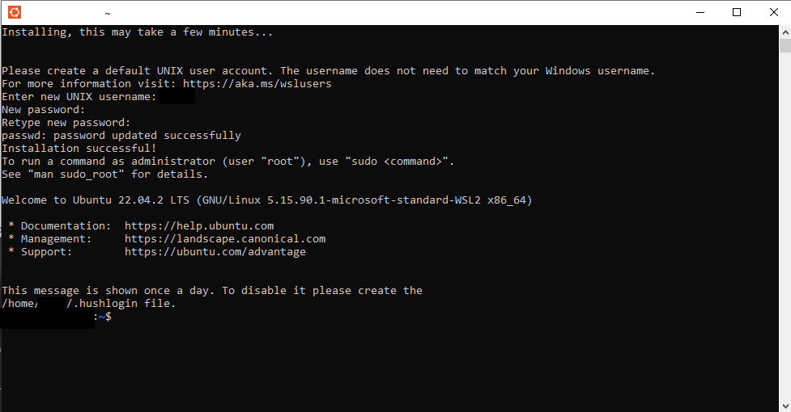

# This page covers docker environment installation
## 1 Local Docker Env Installation

You are a developer and need a local platform running on docker.

### 1.1 Prerequisites

Follow [installation](installation.md) section #2 common setup
> The installation procedure is provided for Linux based environments. 
For Windows users, we recommend the use Ubuntu through Windows Subsystem for Linux (WSL) as described below.

Compile the requirements
```bash
pip install --upgrade pip
pip install pip-tools
./scripts/run_pip_compile.sh
```

#### 1.1.1 (Optional : Windows users only) WSL and/or Ubuntu installation

1. Install WSL2 if using Windows
```bash
wsl --install --web-download
```

2. Install Ubuntu 22.04 LTS 

On Windows with WSL2
```bash
wsl --install -d Ubuntu-22.04
```

As an alternative
You may use directly Ubuntu 22.04 LTS or an equivalent, in this case you may have to make some changes on you own.


1. Launch Ubuntu

 


#### 1.1.2 (Optional : Windows users only) Docker installation on WSL

- Docker 21.0.4 installed and running with your account (on Ubuntu)
- Docker compose 2.17.2 installed (on Ubuntu)

1. Try running  "docker" and  "docker compose" to see if command is recognized
```bash
docker version
docker compose version
docker ps
```
 
If this commands are not working fix docker and docker-compose installation before continuing.

#### 1.1.3 Docker installation tips
Recipe for docker installation is [https://www.digitalocean.com/community/tutorials/how-to-install-and-use-docker-on-ubuntu-22-04](https://www.digitalocean.com/community/tutorials/how-to-install-and-use-docker-on-ubuntu-22-04)
Recipe for docker-compose installation is [https://www.digitalocean.com/community/tutorials/how-to-install-and-use-docker-compose-on-ubuntu-22-04](https://www.digitalocean.com/community/tutorials/how-to-install-and-use-docker-compose-on-ubuntu-22-04)

A few useful commands :
* `sudo usermod -aG docker ${USER}` to add user to docker group
* `sudo service docker start` to start docker service
* `sudo service docker status` to check docker status
* If docker sercice stops after a few seconds, check ip tables
```bash
sudo update-alternatives --config iptables
 
(choose 1 legacy uptables)
 
sudo service docker stop
sudo service docker start
```

### 1.2 Prepare development environment with docker

All the commands below need to be done from the root directory. 

1. Build all docker images
```bash
docker compose build
```

### 1.3 Start and play with your SoSTrades GUI

Here all commands needed to play with the image built are listed : 

- First start of your local GUI instance 
```bash
docker compose up
```

Wait some minutes

Go to [http://127.0.0.1:1080](http://127.0.0.1:1080) with your web browser and connect with the following credentials :

login : user

password : mdp

- Stop the instance 
```bash
docker compose stop
```
- Restart the instance 
```bash
docker compose start
```
- Clean the instance (if errors)
```bash
docker compose down
```

- Start the application with debug mode 
```bash
docker compose -f docker-compose.debug.yml up
```
If using VSCode you will find 4 debug profiles : 

- Remote attach main
- Remote attach message
- Remote attach post processing
- Remote attach data

 

After having launched each debug profile your application should be available on 127.0.0.1:1080 and you will be able to debug it directly running in the container and from VSCode. All debug profiles must be started since flask api are waiting for debug connection to continue. Then without debug connections platform won't be responding.

### 1.5 Useful links

[https://code.visualstudio.com/docs/containers/docker-compose](https://code.visualstudio.com/docs/containers/docker-compose)

[https://code.visualstudio.com/docs/containers/debug-common](https://code.visualstudio.com/docs/containers/debug-common)
