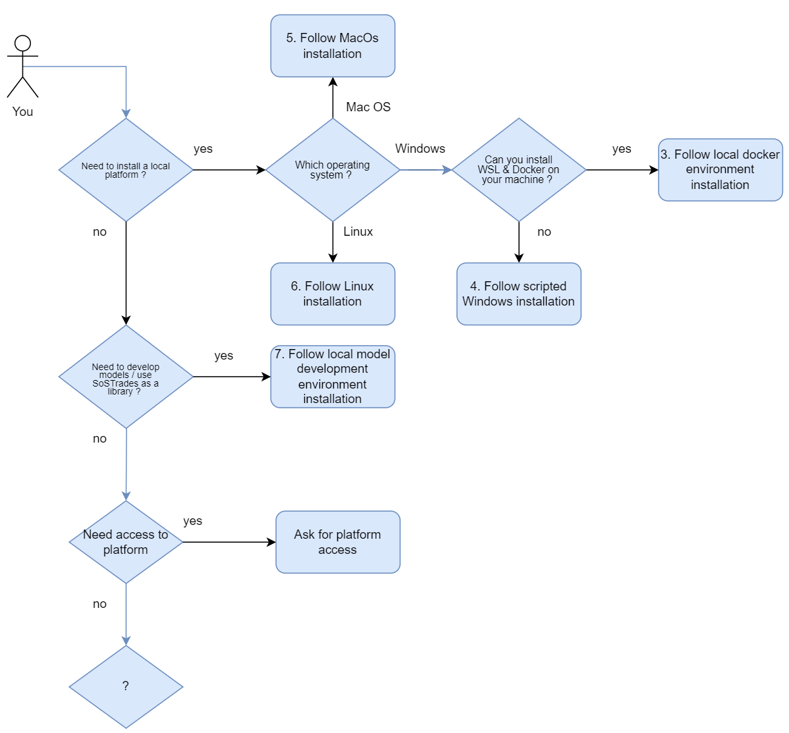
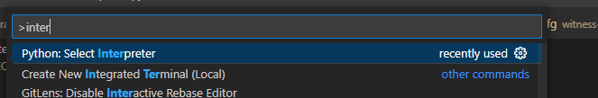
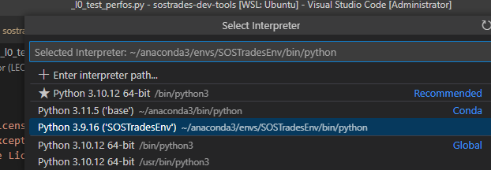
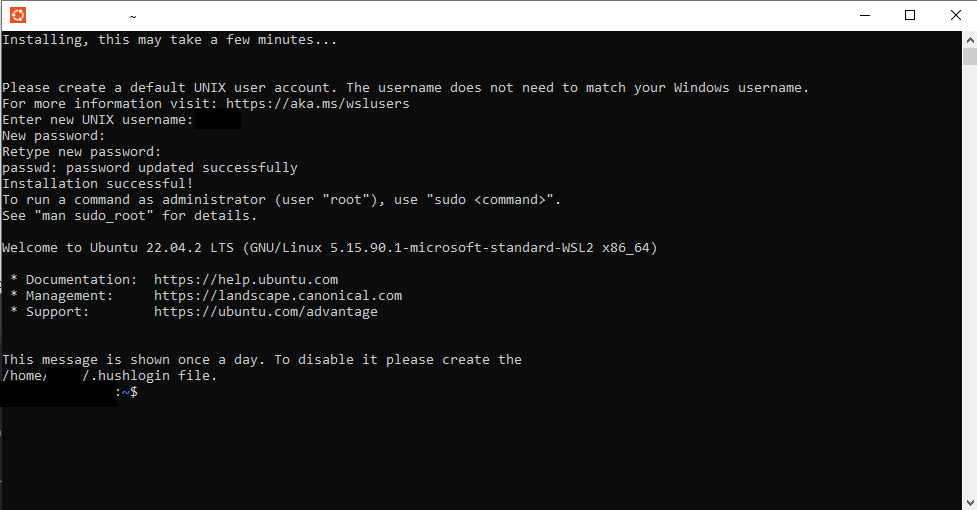
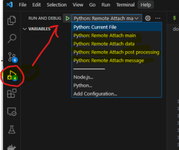

# SoSTrades platform installation

- [Linux Installation](linux-installation.md)

This section is dedicated to install locally either SoSTrades platform or SoSTrades as a library. 

> Feedback is a gift: please note that these installation procedures are still in beta phase. You can contribute to this documentation, give feedbacks and raise a [github issue](https://github.com/os-climate/sostrades-dev-tools/issues).

Please note that supported operating systems are standard Linux-based systems, macOS systems, and Windows.

It contains script facilities to clone repositories, and create virtual environments (using conda) for sostrades project.

The scripts clone the repositories in the correct folder for the rest of the scripts to work properly, as explained in Installation section.
The expected folder organisation is the following :

::

   ├── sostrades-dev-tools
   │   ├── dockers
   │   │   └── docker related files
   │   ├── models
   │   │   ├── witness-core
   │   │   ├── witness-energy
   │   │   └── Other model repositories
   │   ├── platform
   │   │   ├── gemseo
   │   │   ├── sostrades-core
   │   │   ├── sostrades-webapi
   │   │   ├── sostrades-webgui
   │   │   └── sostrades-ontology
   └── other files...

You are then free to change branches, pull changes, clone new model repositories and use scripts at your convenience.

## 1. Choose your installation

Depending on your needs, different environment installations are proposed. A common setup is mandatory whatever the installation you need to perform.

Please consult the diagram below to determine which paragraph you should read.

 


## 2. Common Setup

The objective of this section is to get the environment and all folders properly organized on your local computer to start the installation.

### 2.2 Setup prerequisites
If a prior install of SoSTrades relying on PYTHONPATH is present, it should be disabled during install and platform launch. Otherwise, the freshly-installed platform will try to load the old study references. To do so : Open windows control panel and go to environment variable to delete PYTHONPATH.

#### 2.2.1 Common prerequisites

python version 3.9.x

git

*Note1:* if you have a more recent version of python installed, the `python` command is probably bound to it, resulting in a version issue with the installation scripts. If you installed python 3.9 on top, then you need to use the command `python3.9` hereafter.
Make sure the requirements are properly installed with `python3.9 -m pip install mysql mysql-connector-python==8.3.0`. If the issue persists, you can replace the `python3.9` command by the full path to the correct python executable (3.9.x) in your filesystem.

#### 2.2.2 Linux Installation

This installation is on beta phase. Do not hesitate to contribute to this documentation, give feedbacks and raise an [ github issue](https://github.com/os-climate/sostrades-dev-tools/issues).

The install on Linux operating system should work if you are following sections [3. Local Model Development Env Installation](#3-local-model-development-env-installation) and [4. Local Docker Env Installation](#4-local-docker-env-installation).

Some specific pre-requisites are needed:
```bash
sudo apt-get install libmysqlclient-dev build-essential libldap2-dev libsasl2-dev python-dev-is-python3 libssl-dev
```

#### 2.2.3 Mac OS Installation

Please note that install has been tested on personal Mac OS laptops, but could be different depending on the MacOS version used. Do not hesitate to contribute to this documentation, give feedbacks and raise an [ github issue](https://github.com/os-climate/sostrades-dev-tools/issues).

The install on Mac OS operating system should work if you are following sections [3. Local Model Development Env Installation](#3-local-model-development-env-installation) and [4. Local Docker Env Installation](#4-local-docker-env-installation).

Also, please install the prerequisites listed in Linux installation (libmysqlclient-dev build-essential libldap2-dev libsasl2-dev python-dev-is-python3 libssl-dev)

### 2.3 Clone code and tools

All development environments are built from a dedicated directory initiated with this repository. This directory will be used as root and will contains all the others necessary repositories from OS-Climate. This root directory contains VSCode tasks and launch docker-compose files. This allows to launch SoStrades in docker containers and to debug webapi servers directly from thus container in VS Code. From the repository a script is available to clone all the repositories to prepare the development environment.

1. Clone this repository in root directory and position to last version
```bash
git clone https://github.com/os-climate/sostrades-dev-tools
(For SSH : git clone git@github.com:os-climate/sostrades-dev-tools.git)
 
cd sostrades-dev-tools
# Position to latest tag (ex if v4.1.3 is the latest version)
git checkout v4.1.3
```

*Important:* the root directory name should not contain spaces, and it should be stored in a location where the scripts can write new files (beware of installation in remote filesystems). 
If these conditions are not met, the `PrepareVenv` script might fail and a custom installation of the SoSTrades requirements might be necessary. Try installing in a local filesystem location without spaces.

2. If needed configure model repositories : edit the `model_repositories.json` and `platform_repositories.json` according to what repositories you want. The provided `model_repositories.json` file includes the WITNESS model repositories, as well as the optimization plugins repository required to run WITNESS optimizations :

```json
[
    {
        "url": "https://github.com/os-climate/sostrades-optimization-plugins.git",
        "branch": "validation"
    },{
        "url": "https://github.com/os-climate/witness-core.git",
        "branch": "validation"
    },
    {
        "url": "https://github.com/os-climate/witness-energy.git",
        "branch": "validation"
    }
]
```
3. Launch the `PrepareDevEnv` script
This script will prepare the local working directory as follow :

```
├── sostrades-dev-tools
│   ├── dockers
│   │   └── docker related files
│   ├── docs
│   ├── scripts
│   ├── models
│   │   ├── sostrades-optimization-plugins
│   │   ├── witness-core
│   │   ├── witness-energy
│   │   └── Other model repositories
│   ├── platform
│   │   ├── gemseo
│   │   ├── sostrades-core
│   │   ├── sostrades-webapi
│   │   ├── sostrades-webgui
│   │   └── sostrades-ontology
└── other files...
```

```bash
python scripts/PrepareDevEnv.py
```

## 3. Local Model Development Env Installation
The objective is to have a working local dev environment based on a venv, with pre-configured VS-CODE workspace to be able to run code and debug. Other IDE may be used but should be configured properly.

### 3.1 Prerequisites

Follow [common setup section](#2-common-setup)

### 3.2 Prepare venv
```bash
python scripts/PrepareVenv.py
```

### 3.3 Visual Studio Code (VSCode) 
VSCode settings have been written in dedicated files during execution of `PrepareDevEnv` (in a previous step).

In order to benefit from VSCode settings, type the following command in the `sostrades-dev-tools` directory, at the same level than the `./vscode` (hidden) folder (or `models/` and `platform/` visible directories) :
```bash
code . &
```

### 3.4 Use venv in VS code

In VS Code, use keys windows + shift + p to open command panel, search for "Python: Select Interpreter"

 

Select "Python 3.9.x (".venv")

 

Now you can launch any SoSTrades code from VSCode.


### 3.5 Run venv

To run .venv with all requirements installed, run the following command from your `sostrade-dev-tools` folder:

```
.venv\Scripts\activate
```

To exit the venv just use this command

```
deactivate
```

## 4. Local Docker Env Installation

You are a developer and need a local platform running on docker.

### 4.1 Prerequisites

Follow [common setup section](#2-common-setup)
> The installation procedure is provided for Linux based environments. 
For Windows users, we recommend the use Ubuntu through Windows Subsystem for Linux (WSL) as described below.

Compile the requirements
```bash
pip install --upgrade pip
pip install pip-tools
./scripts/run_pip_compile.sh
```

#### 4.1.1 (Optional : Windows users only) WSL and/or Ubuntu installation

1. Install WSL2 if using Windows
```bash
wsl --install --web-download
```

2. Install Ubuntu 22.04 LTS 

On Windows with WSL2
```bash
wsl --install -d Ubuntu-22.04
```

As an alternative
You may use directly Ubuntu 22.04 LTS or an equivalent, in this case you may have to make some changes on you own.


4. Launch Ubuntu

 


#### 4.1.2 (Optional : Windows users only) Docker installation on WSL

- Docker 24.0.4 installed and running with your account (on Ubuntu)
- Docker compose 2.17.2 installed (on Ubuntu)

1. Try running  "docker" and  "docker compose" to see if command is recognized
```bash
docker version
docker compose version
docker ps
```
 
If this commands are not working fix docker and docker-compose installation before continuing.

#### 4.1.3 Docker installation tips
Recipe for docker installation is [https://www.digitalocean.com/community/tutorials/how-to-install-and-use-docker-on-ubuntu-22-04](https://www.digitalocean.com/community/tutorials/how-to-install-and-use-docker-on-ubuntu-22-04)
Recipe for docker-compose installation is [https://www.digitalocean.com/community/tutorials/how-to-install-and-use-docker-compose-on-ubuntu-22-04](https://www.digitalocean.com/community/tutorials/how-to-install-and-use-docker-compose-on-ubuntu-22-04)

A few useful commands :
* `sudo usermod -aG docker ${USER}` to add user to docker group
* `sudo service docker start` to start docker service
* `sudo service docker status` to check docker status
* If docker sercice stops after a few seconds, check ip tables
```bash
sudo update-alternatives --config iptables
 
(choose 1 legacy uptables)
 
sudo service docker stop
sudo service docker start
```

### 4.2 Prepare development environment with docker

All the commands below need to be done from the root directory. 

1. Build all docker images
```bash
docker compose build
```

### 4.3 Start and play with your SoSTrades GUI

Here all commands needed to play with the image built are listed : 

- First start of your local GUI instance 
```bash
docker compose up
```

Wait some minutes

Go to [http://127.0.0.1:1080](http://127.0.0.1:1080) with your web browser and connect with the following credentials :

login : user

password : mdp

- Stop the instance 
```bash
docker compose stop
```
- Restart the instance 
```bash
docker compose start
```
- Clean the instance (if errors)
```bash
docker compose down
```

- Start the application with debug mode 
```bash
docker compose -f docker-compose.debug.yml up
```
If using VSCode you will find 4 debug profiles : 

- Remote attach main
- Remote attach message
- Remote attach post processing
- Remote attach data

 

After having launched each debug profile your application should be available on 127.0.0.1:1080 and you will be able to debug it directly running in the container and from VSCode. All debug profiles must be started since flask api are waiting for debug connection to continue. Then without debug connections platform won't be responding.

### 4.5 Useful links

[https://code.visualstudio.com/docs/containers/docker-compose](https://code.visualstudio.com/docs/containers/docker-compose)

[https://code.visualstudio.com/docs/containers/debug-common](https://code.visualstudio.com/docs/containers/debug-common)

## 5. Local platform without docker (Windows only)

It is possible to run SoSTrades on Windows without installing docker by running some scripts. It is recommended to follow step by step the installation below, because if you skip a script the next one may not work properly. Every script is stored in the folder `sostrades-dev-tools\scripts\`

### 5.1 Prerequisites

The repository sostrades-dev-tools and all scripts need the following prerequisites:
> - Follow [common setup section](#2-common-setup)
> - Follow [local model development env installation section](#3-local-model-development-env-installation)

### 5.2 Run install scripts

First follow sections:
> - Follow [common setup section](#2-common-setup)
> - Follow [local model development env installation section](#3-local-model-development-env-installation)

Then run `Configuration.py` to create folder and files needed to run SoSTrades:

```
python scripts\Configuration.py
```

Then run `NodeInstallation.py` to install NVS with the good version of Node at the end of the script it will ask you if you want to build the webgui:

```
python scripts\NodeInstallation.py 
```

To create an user to access to SoSTrades platform run `CreateUser.py`:

```
python scripts\CreateUser.py
```
Important: the `CreateUser.py` script will ask you to input some information (user, name, last name and e-mail). Leaving any of these fields empty will result in the script crashing, at least a character is required. 

If you want to update Ontology execute the script `UpdateOntology.py`. This script could take more than 15mn it depends on the number of repository you have.

```
python scripts\UpdateOntology.py
```

### 5.3 Start SoSTrades platform 

Finally run the script `StartSOSTrades.py` to launch SoSTrades :

```
python scripts\StartSOSTrades.py
```

When the last script is running you can go to [http://localhost:4200](http://localhost:4200) with your web browser and connect with your credentials just created before.


### 5.4 Pull repositories

If you need to pull all your repositories (both platform and models) you can execute the script `PullRepositories.py` : 

```
python scripts\PullRepositories.py
```

## 6. Scripts explanation
> - PrepareDevEnv.py : script to download all model repositories from model_repositories.json and platform repositories from platform_repositories.json with git clone command. Repositories are cloned in sostrades-dev-tool\models and sostrades-dev-tool\platform. The script also creates a `sostrades-dev-tools\.vscode\setting.json` file with extraPaths according to the repository cloned,

> - PrepareVenv.py: script to install a venv in the folder `sostrades-dev-tools\.venv\` with the python 3.9 and install all requirements of SoSTrades,

> - Configuration.py: script to create files and folders needed by SoSTrades
>> - `sostrades-dev-tools\platform\sostrades-webapi\sos_trades_api\configuration_template\configuration.json`
>> - `sostrades-dev-tools\platform\sostrades-webapi\.flaskenv`
>> - `sostrades-dev-tools\data\REFERENCES\`
>> - `sostrades-dev-tools\data\RSA\private_key.pem`
>> - `sostrades-dev-tools\data\RSA\public_key.pem`

> - `NodeInstallation.py`: script to install a NVS (Node Version Switcher) and also install a version of Node with NVS. In addition it is possible to build sostrades-webgui

> - `CreateUser.py` : script that creates an user in SoSTrades with the command `flask create_standard_user`. When the user is created, a password is temporarily saved in `sostrades-dev-tools\platform\sostrades-webapi\sos_trades_api\secret\*`. Once stored, the password has to be deleted. Some SoSTrades app rights are granted in the database with flask command.

> - `UpdateOntology.py` script will execute with your `.venv` the command `python sos_ontology\core\script\createSoSOntologyFromCode.py`in `sostrades-ontology` folder to update ontology with all your repositories

> - `StartSOSTrades.py` : script that run api server, ontology server, and webgui server with venv and node

> - `FullInstall.py` : script for a direct full install. Execute like `python scripts\FullInstall.py`
