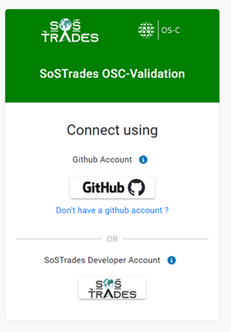

# User Manual

This documentation manual is designed for people seeking to deepen their understanding of using the SoSTrades GUI platform.

SoSTrades is a web-based, multi-user, interactive publication-quality graph simulation platform. It allows users to drop new modules without additional coding, and provides embedded advanced numerical capabilities for simulation and multi-disciplinary optimization. It also has built-in collaborative capabilities to allow different experts to work together.

It provides comprehensive guidance on navigating the GUI for easy interaction. Learn how to create, modify, run, and open userr studies, as well as visualize existing ones.

## Chapter 1: SOSTrades GUI Connexion 
This chapter offers all the necessary explanations for easily connecting the SoSTrades Graphical User Interface.  

If user has not a github account it can click on the link "Don't have a github account" to create one.  

### Section 1.1: First connexion on cloud landing page

### Section 1.2: Connexion on local machine

The connexion with a developer account is only necessary when user use sostrades in a local environment

## Chapter 2: GUI Homepage and Menus
TBD
### Section 2.1: Homepage infos
- Favorite studies 
- Platform date & name
- colors
- how to logout
- contact us

### Section 2.2: Study Management Visualisation
TBD

### Section 2.3: Reference management Visualisation
### Section 2.3: Group Management
Each user belongs to, at least, one group with rights. 
- **Owner** : When a user create a group, he is the owner of the group. The owner cannot be changed and has the full rights on the group (edition, deletion, manage access rights).
- **Manager** : an edit a group (name and description), manage access rights to the group (can add or remove user or group, but cannot change its own access right nor the owner), can create study into this group. A manager can't delete a group, only the owner can do it.
- **Member** : A member of a group can only create studies into this group. 

**These groups contain studies created by user and provide user an access right on it.**

When a group is linked to a process, a study, or another group, the users and/or groups within the group inherit the associated access rights.  
For example:  
if a group is added as a manager in a process entity's rights, all users in the group (owner, manager, or member) will be managers of the process.  
If a group is added as a restricted viewer in a study-case entity's rights, all users in the group (owner, manager, or member) will be restricted viewers of the study-case.  
If a user in the restricted viewer group is also added as a manager in the same study-case entity's rights, they will have manager rights for this study-case.

#### Subsection 2.3.1 Create group
  
To create a new group, user must fill in the name and description.  
:warning: Note: If user select confidential, the data will be encrypted. Even developers will not have access to it, and there will be no possibility to directly download the results.

#### Subsection 2.3.2 Select a default group
 
If user select a default group, it will be preselected during a study creation.

#### Subsection 2.3.3 Share a group
If user is manager of the group, he can also add in this group, an other or several users and/or groups, witch can contain several users, by clicking on the share icon 

This user can also modify the access rights of a user or a group present in this group.

#### Subsection 2.3.4 Delete a group

  
**Removing a group will delete all studies that belong to this group.**

### Section 2.4: Ontology Menu
TBD
## Chapter 3: Study Operations
TBD
### Section 3.1: Create a study

- from scratch
- from a reference
- explain all inputs 
- copy a study 

### Section 3.2 Study panels and visualisation
TBD
#### Subsection 3.2.1 Study Panels
Explain treeview, node status, validation state, study link and user collaboration
Explain all study panels (data management, post processing,documentation)
Explain that Dashboard is not implemented yet 
#### Subsection 3.2.2 Study Visualisation
Explain interface diagram, execution sequence & study coupling graph

#### Subsection 3.2.3 Study Logs and notifications
Explain logs & notifications

### Section 3.3 Data management and study configuration
explaon how to save data, how to import data from csv,dataset, ...
### Section 3.4 Study execution

### Section 3.5 Study post-processing
explain post-procs and filters 

### Section 3.6 Open an existing study
explain how to open, edition mode, search variables, filters, fullscreen, user visu (standard, expert)