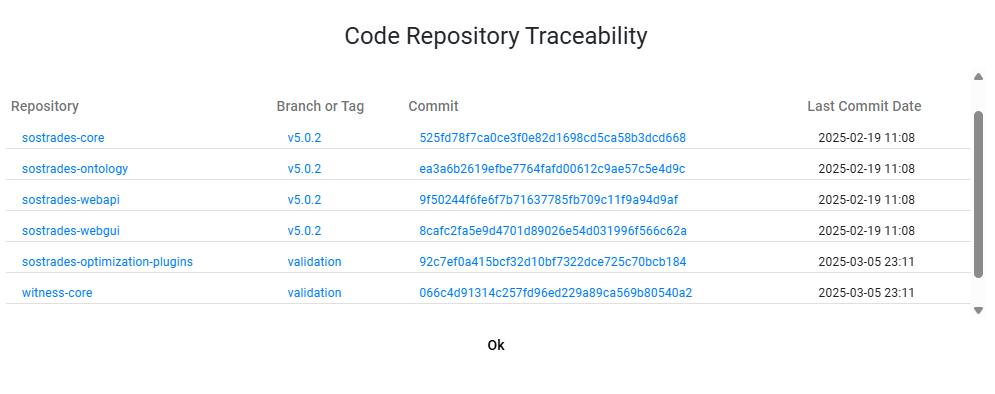
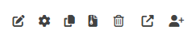
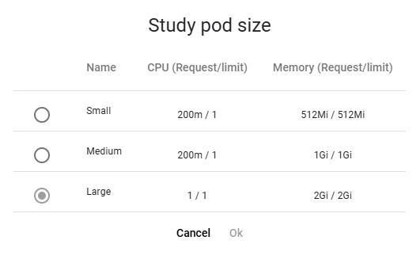
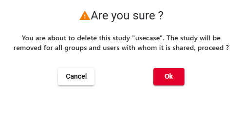

# User manual

This documentation manual is designed for people seeking to deepen their understanding of using the SoSTrades GUI platform.

SoSTrades is a web-based, multi-user, interactive publication-quality graph simulation platform. It allows users to drop new modules without additional coding, and provides embedded advanced numerical capabilities for simulation and multi-disciplinary optimization. It also has built-in collaborative capabilities to allow different experts to work together.

It provides comprehensive guidance on using the GUI for seamless interaction. Learn how to create, modify, run, and open
user studies, as well as visualize existing ones.

## Chapter 1: SOSTrades GUI connexion 

This chapter offers all the necessary explanations for easily connecting the SoSTrades Graphical User Interface. There are possibilities that you can meet to connect on it, the cloud one and the local one. 

### Section 1.1: First connexion on cloud landing page

The cloud platform is a collaborative environment where all developer contributions are tested and validated before becoming available on the final link: [https://validation.osc-tsa.com](https://validation.osc-tsa.com).  
On the cloud login page, a redirection occurs to the Keycloak homepage, allowing authentication with a local Keycloak account created by an administrator. Keycloak is an open-source identity and access management solution that we have chosen to handle authentication and user management on the platform. Alternatively, a personal GitHub or Google account can be used by clicking the associated button. Github and Google account should have the same email address to be associated to the same account.

### Section 1.2: Connexion on local machine
SoSTrades can be installed on a local machine by following this installation [documentation](installation.md). Once the installation is successfully completed, the user created with the `CreateUser.py` script from the documentation can be used to access the local platform at [http://localhost:4200/](http://localhost:4200/). The user password can be found in the following path: `./sostrades-dev-tools-test-uv/platform/sostrades-webapi/sos_trades_api/secret/`.  

## Chapter 2: GUI Homepage and menus

This chapter provides an overview of the GUI homepage, navigation menus, including study and reference management, as well as group management, the Ontology and the manager dashboard.

### Section 2.1: Homepage infos

After connecting to SoSTrades GUI platform they are many informations displayed on the homepage. Each numbered boxes are described bellow:
- **1- Menu button:** From this button you can navigate to the different pages of the GUI which will be detailed in next chapters.
- **2- Platform information:** In this box, the name and creation date of the platform are displayed. When you are connected to a cloud platform, the box is clickable to view more details about the different Git repositories the platform is based on.
- **3- User information:** The name of the current user is displayed
- **4- Contact button:** Show the email address of the support team
- **5- Logout button:** Here is the button to logout
- **6- Favorite studies:** At the bottom of the homepage there are the last opened and favorite study of the current user. Users can mark their favorite studies with a star in the study management panel (see the next section).
- **7- Header color:** The color of the header is configurable during the platform's creation. For example the cloud
  open source validation platform is green, different color than the purple one for local platforms.

By clicking on the Platform Information box, a table appears summarizing all Git repository details used to build the platform. The table includes the repository name, the branch or tag in use, the commit identifier, and the last commit date. This allows users to track the exact versions of the different components that make up the platform.  
  
  

### Section 2.2: Group management

The Group Management feature, accessible via the menu button, allows users to organize access rights within the platform. 

Each user connected to the platform belongs to, at least, one group with rights.

- **Owner** : When a user create a group, he is the owner of the group. The owner cannot be changed and has the full rights on the group (edition, deletion, manage access rights).
- **Manager** : Can edit a group (name and description), manage access rights to the group (can add or remove user or
  group, but cannot change its own access right nor the owner), can create study into this group. A manager can't delete
  a group, only the owner can do it.
- **Member** : A member of a group can only create studies into this group. 

These groups contain user and each user in the group has access to what belongs to it. It can be :

- another group of user
- a process (bunch of models), it is possible to link a process to a given group
- a study created by someone in the group or added by someone else that has given access to it

When a group is linked to a process, a study, or another group, the users and/or groups within the group inherit the
associated access rights.

For example:  
if a group is added as a manager in a process entity's rights, all users in the group (owner, manager, or member) will be managers of the process.  
If a group is added as a restricted viewer in a study-case entity's rights, all users in the group (owner, manager, or member) will be restricted viewers of the study-case.  
If a user in the restricted viewer group is also added as a manager in the same study-case entity's rights, they will have manager rights for this study-case.

By default at the first connexion on the GUI, the new users are in "All users" group. 

#### Subsection 2.2.1 Create group
  
To create a new group, user must fill in the name and description.  
:warning: Note: If user select confidential, the data will be encrypted. Even developers will not have access to it, and there will be no possibility to directly download the results.

#### Subsection 2.2.2 Select a default group
  
If user select a default group, it will be preselected during a study creation.

#### Subsection 2.2.3 Share a group
If user is manager of the group, he can also add in this group, an other or several users and/or groups, witch can contain several users, by clicking on the share icon 

This user can also modify the access rights of a user or a group present in this group.  

#### Subsection 2.2.4 Delete a group
  
**Removing a group will delete all studies that belong to this group.**

### Section 2.3: Study management visualisation

From the menu button, it is possible to access the study management page and list all the studies that the current user can access, according to their rights on each study, as well as the rights of the groups to which they belong. On that page, it is possible to search for a study by name using the search bar. A study can also be created with the 'Create Study' button, which will be explained in more detail later in this documentation.  

#### Subsection 2.3.1: Study management column

The study management list includes several columns that provide detailed information about each study:

- Study Name: The name of the study.
- Group: The group to which the study belongs.
- Repository: The code repository associated with the study.
- Process: The process used for the study.
- Execution Status: The current execution state of the study.
- Pod Size: The computing resources allocated to the study. (This column appears only when using the hosted GUI and not on a local machine, as a pod is used for computation in the hosted environment.)
- Creation Date: The date the study was created.
- Modification Date: The date the study was last modified.

#### Subsection 2.3.2: Filter bar

To facilitate the search for a study, a filter bar is available, allowing users to find a study using the dedicated field. 
  
To filter by keyword in a specific column of the study management table, you can keep "All columns" selected for a broad search. For a more specific search, select "Name" from the dropdown menu to filter by study name, as shown in the example:  
  

#### Subsection 2.3.3: Favorite

It is possible to mark a study as a favorite by clicking on the star icon , which will turn yellow. Selecting a study as a favorite will make it visible on the homepage, and it will also be easier to find in the study management list by sorting the table using the corresponding column.

#### Subsection 2.3.4: Study case opening

There are two ways to open a study: in read-only mode  or edition mode , each with its own associated icon. Alternatively, a study can be opened by clicking on its name. If the study has already been computed, it will open in read-only mode; otherwise, it will open in edition mode. The read only and edition mode will be explained in more detail in the chapter on Study Operations.

#### Subsection 2.3.5: Study case option icons

By hovering over the same row as a study, additional icons appear on the right side, providing more options for interaction:  

- The firs icon  allows you to modify the name of the study or change the group of the study:  
  

- The second icon  is available only when you are in hosted GUI that allow to configure the pod size when opening a study as edition mode:  
  

- The third icon  allows to duplicate the study with another name:  
  

- The next icon  is for deleting a study.  
  

- This icon  allows to get the link of study to be shared:  
  

- The last icon  allows to manage group or user rights on that study:  
 

### Section 2.4: Reference management visualisation

References are predefined examples of a process with selected data set by developers. Once computed, a reference can be reused to create studies. The advantage of creating a study from a reference is that it eliminates the need to start from scratch, saving time and effort.
Similar to the study management page, the reference management page can be accessed from the menu button to list references and can also be found using the filter bar similar to the study management filter bar.

A reference is visible in the Reference Management page only if the user has the necessary rights on the process associated with that reference. The process rights will be explained in detail in [Section 2.6: Manager Dashboard](#section-26-manager-dashboard).

Before to be used a reference has to be generate with that button  When a reference is not generated the Status of the reference is  Then once you generate a reference it turns into  during the compute. And finally it turns into  and the button create study  is available to create a study from reference.

Each generated reference will have a log file available through the download button  which records the computation details in the file.

When generating a reference in the cloud platform, it is possible to select the pod size using the Pod Size button to define the computing resources allocated to generate the reference  . In contrast, on a local machine installation, there is no need to choose a pod size, as the reference will use the full capacity of the machine.

### Section 2.5: Ontology menu

The SoSTrades Ontology is composed of all entities and relationships between concepts used in the Systems of Systems Trades project. The main concepts modeled are Code Repositories, Process Repositories, Processes, Models, Usecases and Parameters. For each instance, the ontology store metadata (label, description, documentation, ...) that are extracted from the Python code stored in the code repositories of the project in Gitlab. This ontology primary purpose is to complement the Web Interface of SoSTrades with these metadata to have a better lisibility and understandability. It is also a good way to explore the available concepts in the SoSTrades platform.

#### Subsection 2.5.1: Ontology homepage

As the same way of other pages of SoSTrades you can access to the Ontology homepage from the menu button at the top left of the homepage and select Ontology.  
  
In the Ontology homepage, there are four tabs: Homepage, Models, Processes, and Parameters. At the bottom left of the page, a summary list displays the number of code repositories, models, parameters, processes, process repositories, and the usecases. 
  

#### Subsection 2.5.2: Ontology code repository traceability
By clicking on the Code Repositories link, a table appears displaying information about the different Git repositories used to build the platform. The three other links, Models, Parameters, and Processes, display the same content as their corresponding tabs at the top of the Ontology homepage.  
    
  

#### Subsection 2.5.3: Ontology model tab
In the Models tab, a list of all models from each code repository is displayed, including the model name, the number of processes that use the model, and documentation.
  
With the documentation icon  more details about the model can be accessed.  
  

#### Subsection 2.5.4: Ontology porocesses tab
In the Processes tab, all processes are listed along with their associated repositories and the number of models used by each process. Additionally, for each process, there are options to create a study from the process, grant access rights to a user or group, and view the process documentation.

Only processes that you have the right to see are displayed.

#### Subsection 2.5.5: Ontology parameters tab
And lastly, the Parameters tab displays a list of all existing parameters used by a model. More details about each parameter can be accessed using the documentation icon.  

### Subsection 2.6: Manager dashboard
As an administrator, an additional option, Manager Dashboard, is available in the menu button. From this page, administrators can:
- View all users created on the platform along with their current rights.
- See all existing processes and manage user and group access rights for these processes.
- Access a list of all study executions.  

#### Subsection 2.6.1: User management
In the user management page you can have a list of all existing user and more information of the user. Moreover you have the current user profile. The user profil will be details in the next subsection. 

#### Subsection 2.6.2: User profile 

There are three profiles that can be assigned to an user or a group in SoSTrades: "Study User," "Study User Without Execution," and "Study Manager." A profile defines the user's role and permissions within the platform.

- **Study user without Execution** : can only open studies.
- **Study user** : can modify a study, execute a study, generate references.
- **Study manager** : can do all of the previous profiles and grant right to a user or a group.

By default when you are in local machine you have the study manager profile and when you are in hosted platform you are with "Study user without Execution" profile.

If your profile need to be granted on the hosted platform, you need to contact and administrator to change it on Keycloak.

#### Subsection 2.6.3: Processes management 

Processes can be manage from that page:

On that management page you can grant access to an user or group on a processes with the button   

By default, processes are assigned the SoSTrades_Dev group as their manager. This means that only administrators can see new processes, as only administrators belong to the SoSTrades_Dev group.

It is possible to assign a default group to all processes within a code repository by editing the default_process_rights.yaml file located in the root of the repository.

#### Subsection 2.6.4: Execution dashboard

On the Execution Dashboard page, all study executions on the platform are accessible. For each execution, the logs can be downloaded.

## Chapter 3: Study Operations
TBD
### Section 3.1: Create a study

- ReadOnly mode
- from scratch
- from a reference
- explain all inputs 
- copy a study 

### Section 3.2 Study panels and visualisation
TBD
#### Subsection 3.2.1 Study Panels
Explain treeview, node status, validation state, study link and user collaboration
Explain all study panels (data management, post processing,documentation)
Explain that Dashboard is not implemented yet 
#### Subsection 3.2.2 Study Visualisation
Explain interface diagram, execution sequence & study coupling graph

#### Subsection 3.2.3 Study Logs and notifications
Explain logs & notifications

### Section 3.3 Data management and study configuration
explaon how to save data, how to import data from csv,dataset, ...
### Section 3.4 Study execution

### Section 3.5 Study post-processing
explain post-procs and filters 

### Section 3.6 Open an existing study
explain how to open, edition mode, search variables, filters, fullscreen, user visu (standard, expert)