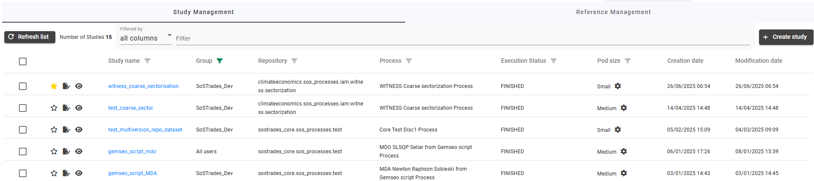
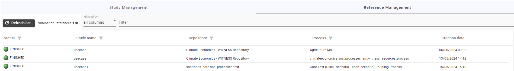
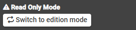
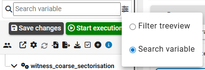
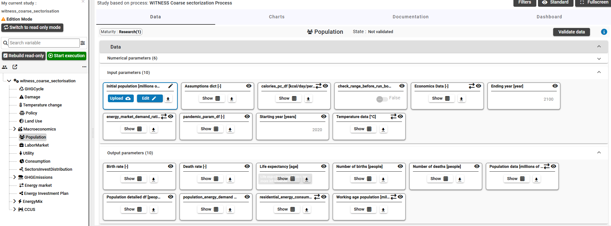
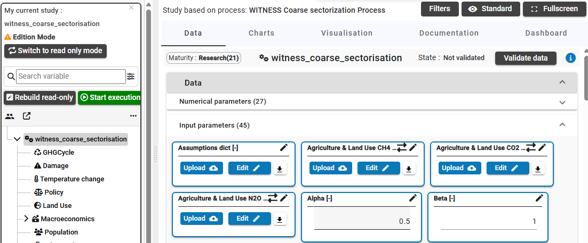
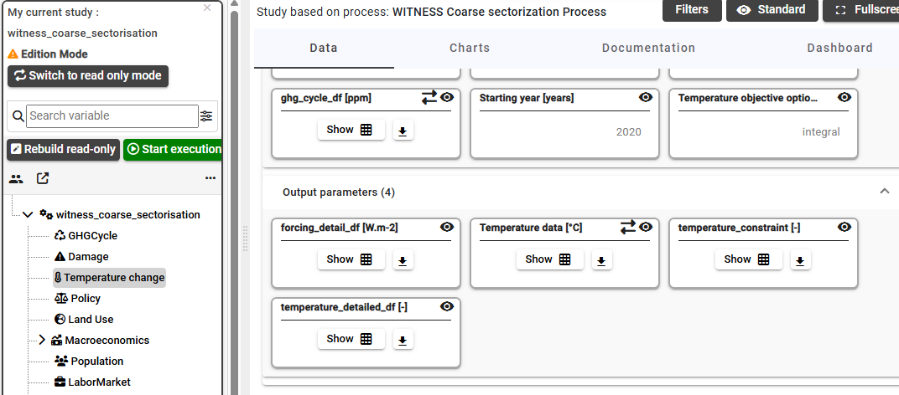
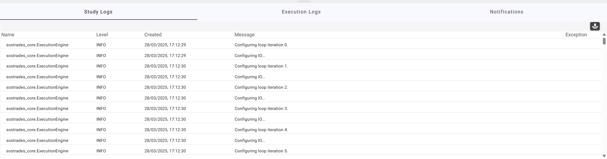

# User manual

This documentation manual is designed for people seeking to deepen their understanding of using the SoSTrades GUI platform.

SoSTrades is a web-based, multi-user, interactive publication-quality graph simulation platform. It allows users to drop new modules without additional coding and provides embedded advanced numerical capabilities for simulation and multi-disciplinary optimization. It also has built-in collaborative capabilities to allow different experts to work together.

It provides comprehensive guidance on using the GUI for seamless interaction. Learn how to create, modify, run, and open
user studies, as well as visualise existing ones.

## Chapter 1: SOSTrades GUI connection 

This chapter offers all the necessary explanations to connect easily the SoSTrades Graphical User Interface. The platform may be deployed Locally or on the Cloud.

### Section 1.1: First connection on cloud landing page

The cloud platform is a collaborative environment where all developers' contributions are tested and validated before becoming available on the final link: [https://validation.osc-tsa.com](https://validation.osc-tsa.com).  
On the cloud login page, a redirection occurs to the Keycloak homepage, allowing authentication with a local Keycloak account created by an administrator. Keycloak is an open-source identity and access management solution that we have chosen to handle authentication and user management on the platform. Alternatively, a personal GitHub or Google account can be used by clicking the associated button. Github and Google account should have the same email address to be associated to the same account.

### Section 1.2: Connection on local machine
SoSTrades can be installed on a local machine by following this installation [documentation](installation.md). Once the installation is successfully completed, the user created with the `CreateUser.py` script from the documentation can be used to access the local platform at [http://localhost:4200/](http://localhost:4200/). The user password can be found in the following path: `./sostrades-dev-tools-test-uv/platform/sostrades-webapi/sos_trades_api/secret/`.  

## Chapter 2: GUI Homepage and menus

This chapter provides an overview of the GUI homepage, navigation menus, including study and reference management, as well as group management, the ontology and the manager dashboard.

### Section 2.1: Homepage information

After connecting to SoSTrades GUI platform there is a lot of information displayed on the homepage. Each numbered box is described below:
- **1- Menu button:** From this button you can navigate to the different pages of the GUI which will be detailed in next chapters.
- **2- Platform information:** In this box, the name and creation date of the platform are displayed. When you are connected to a cloud platform, the box is clickable to view more details about the different Git repositories the platform is based on.
- **3- User information:** The name of the current user is displayed
- **4- Contact button:** Show the email address of the support team
- **5- Logout button:** Logs out the user
- **6- Favorite studies:** At the bottom of the homepage there are the last opened and favorite study of the current user. Users can mark their favorite studies with a star in the study management panel (see the next section).
- **7- Header color:** The color of the header depends of the environment : validation platforms are green, latest are blue, integration orange and purple for local platforms.

By clicking on the Platform Information box, a table appears summarizing all Git repository details used to build the platform. The table includes the repository name, the branch or tag in use, the commit identifier, and the last commit date. This allows users to track the exact versions of the different components that make up the platform.  
  
  

### Section 2.2: Group Management

The Group Management feature, accessible via the menu button, allows users to manage access rights within the platform.

Each user connected to the platform is assigned to at least one group with specific access rights.

Here is the description of level of membership in a group:

- **Owner**: When a user creates a group, they become the owner of that group. The owner cannot be changed and has full rights over the group (editing, deletion, and managing access rights).
- **Manager**: A manager can edit the group (name and description), manage access rights (add or remove users or groups), and create studies within the group. A manager can't change their own access rights or those of the owner, nor can they delete the group—only the owner can do that.
- **Member**: A member can only create studies within the group.

These groups contain users, each of whom has access to the resources associated with the group. These resources can include:

- Other user groups
- A process (a collection of models), which can be linked to a specific group
- A study created by a group member or shared by another user who has granted access

When a group is linked to a process, study, or another group, the users and/or groups within the linked group inherit the associated access rights.

For example:  
- If a group is added as a manager to the rights of a process entity, all users in the group (owner, manager, or member) will have manager rights for that process.  
- If a group is added as a restricted viewer to a study-case entity's rights, all users in the group (owner, manager, or member) will be restricted viewers of the study-case.  
- If a user in the restricted viewer group is also added as a manager in the same study-case entity's rights, they will have manager rights for that study-case.

By default, when a new user first logs in to the GUI, they are placed in the "All Users" group. 

#### Subsection 2.2.1 Create group
  
To create a new group, user must fill in the name and description.  
Note: If user select confidential, the data will be encrypted. Even developers will not have access to it, and there will be no possibility to directly download the results.

#### Subsection 2.2.2 Select a default group
  
If user select a default group, it will be preselected during a study creation.

#### Subsection 2.2.3 Share a group
If user is manager of the group, he can also add in this group, another or several users and/or groups, which can contain several users, by clicking on the share icon 

This user can also modify the access rights of a user or a group present in this group.  

#### Subsection 2.2.4 Delete a group
  
**Removing a group will delete all studies that belong to this group.**

### Section 2.3: Study management visualisation

From the menu button, it is possible to access the study management page and list all the studies that the current user can access, according to their rights on each study, as well as the rights of the groups to which they belong. On that page, it is possible to search for a study by name using the search bar. A study can also be created with the 'Create Study' button, which will be explained in more detail later in this documentation.  

#### Subsection 2.3.1: Study management column

The study management list includes several columns that provide detailed information about each study:

- Study Name: The name of the study.
- Group: The group to which the study belongs.
- Repository: The code repository associated with the study.
- Process: The process used for the study.
- Execution Status: The current execution state of the study.
- Pod Size: The computing resources allocated to the study (see section 4.1 for more details). (This column appears only
  when using the hosted GUI and not on a local machine, as a pod is used for computation in the hosted environment.)
- Creation Date: The date the study was created.
- Modification Date: The date the study was last modified.

#### Subsection 2.3.2: Filter bar

To facilitate the search for a study, a filter bar is available, allowing users to find a study using the dedicated field. 
  
To filter by keyword in a specific column of the study management table, you can keep "All columns" selected for a broad search. For a more specific search, select "Name" from the dropdown menu to filter by study name, as shown in the example:  
  

#### Subsection 2.3.3: Favorite

It is possible to mark a study as a favorite by clicking on the star icon , which will turn yellow. Selecting a study as a favorite will make it visible on the homepage, and it will also be easier to find in the study management list by sorting the table using the corresponding column.

#### Subsection 2.3.4: Study case opening

There are two ways to open a study: in read-only mode  or edition mode , each with its own associated icon. Alternatively, a study can be opened by clicking on its name. If the study has already been computed, it will open in read-only mode; otherwise, it will open in edition mode. The read only and edition mode will be explained in more detail in the chapter on Study Operations.

#### Subsection 2.3.5: Study case option icons

By hovering over the same row as a study, additional icons appear on the right side, providing more options for interaction:  

- The firs icon  allows you to modify the name of the study or change the group of the study:  
  

- The second icon  is available only when you are in hosted GUI that allow to configure the pod size when opening a study as edition mode:  
  

- The third icon  allows to duplicate the study with another name:  
  

- The next icon  is for downloading a study in zip format. It contains the read only mode, the study data, all post processing charts and visualization diagrams. It is possible only if the study has a read only mode. This study zip can be imported again in this platform in stand-alone format or in another platform version.  

- The next icon  is for deleting a study.  
  

- This icon  allows to get the link of study to be shared:  
  

- The last icon  allows to manage group or user rights on that study (see next subsection for more details on study roles):  
 

#### Subsection 2.3.6: Study roles

There are 5 access rights possible when giving access to a study:
- **Restricted viewer**: can copy, load a study, see only the post-processings of the study and documentation. He can't modify the study in any way nor see the data used in the study-case.
- **Commenter**: has the restricted viewer right and can see the study data, load the study-case, download the study-case data, but can't modify it. He cannot edit the name and group of the study-case nor delete it or change access rights. Even if the user has a profile with execution rights, he cannot execute the study-case.
- **Contributor**: is a commenter that can also copy, save parameters, reload the study. He cannot edit the name and group of the study-case nor delete it or change access rights. If the user has a profile with execution rights, he can execute the study-case.
- **Manager**: has the contributor rights and can also edit, delete and change access rights of the study-case (except for the owners and himself rights). 
- **Owner**: When a user creates a study-case, he is the owner of the study-case. The owner cannot be changed and has all the rights that a manager has. But, even if he is the owner, he cannot execute the study if he has the profile study user without execution rights.  
When a study-case is created, the group that is associated to the study-case at the creation is also owner of the study-case. All users in this group are manager of the study-case.

 

### Section 2.4: Reference management visualisation

References are predefined examples of a process with selected data set by developers. Once computed, a reference can be reused to create studies. The advantage of creating a study from a reference is that it eliminates the need to start from scratch, saving time and effort.
Like the study management page, the reference management page can be accessed from the menu button to list references and can also be found using the filter bar like the study management filter bar.

A reference is visible in the Reference Management page only if the user has the necessary rights on the process associated with that reference. The process rights will be explained in detail in [Subsection 2.6.3: Processes management](#section-26-manager-dashboard).

Before to be used a reference must be generated with that button  When a reference is not generated the Status of the reference is  Then once you generate a reference it turns into  during the computation. And finally, it turns into  and the button create study  is available to create a study from reference.

Each generated reference will have a log file available through the download button  which records the computation details in the file.

When generating a reference in the cloud platform, it is possible to select the pod size using the Pod Size button to define the computing resources allocated to generate the reference  . In contrast, on a local machine installation, there is no need to choose a pod size, as the reference will use the full capacity of the machine.

### Section 2.5: Ontology menu

The SoSTrades Ontology is composed of all entities and relationships between concepts used in the Systems of Systems Trades project. The main concepts modelled are Code Repositories, Process Repositories, Processes, Models, Usecases and Parameters. For each instance, the ontology store metadata (label, description, documentation, ...) that are extracted from the Python code stored in the code repositories of the project in Gitlab. This ontology primary purpose is to complement the Web Interface of SoSTrades with these metadata to have a better readability and understandability. It is also a good way to explore the available concepts in the SoSTrades platform.

#### Subsection 2.5.1: Ontology homepage

As the same way of other pages of SoSTrades you can access to the Ontology homepage from the menu button at the top left of the homepage and select Ontology.  
  
In the Ontology homepage, there are four tabs: Homepage, Models, Processes, and Parameters. At the bottom left of the page, a summary list displays the number of code repositories, models, parameters, processes, process repositories, and the usecases. 
  

#### Subsection 2.5.2: Ontology code repository traceability
By clicking on the Code Repositories link, a table appears displaying information about the different Git repositories used to build the platform. The three other links, Models, Parameters, and Processes, display the same content as their corresponding tabs at the top of the Ontology homepage.  
    
  

#### Subsection 2.5.3: Ontology model tab
In the Models tab, a list of all models from each code repository is displayed, including the model name, the number of processes that use the model, and documentation.
  
With the documentation icon  more details about the model can be accessed.  
  

#### Subsection 2.5.4: Ontology processes tab
In the Processes tab, all processes are listed along with their associated repositories and the number of models used by each process. Additionally, for each process, there are options to create a study from the process, grant access rights to a user or group, and view the process documentation.

Only processes that you have the right to see are displayed.

#### Subsection 2.5.5: Ontology parameters tab
And lastly, the Parameters tab displays a list of all existing parameters used by a model. More details about each parameter can be accessed using the documentation icon.  

### Section 2.6: Manager dashboard
As an administrator, an additional option, Manager Dashboard, is available in the menu button. From this page, administrators can:
- View all users created on the platform along with their current rights.
- See all existing processes and manage user and group access rights for these processes.
- Access a list of all study executions.  

#### Subsection 2.6.1: User management
In the user management page, you can have a list of all existing user and more information of the user. Moreover, you have the current user profile. The user profile will be details in the next subsection. 

#### Subsection 2.6.2: User profile 

There are three profiles that can be assigned to a user or a group in SoSTrades: "Study User," "Study User Without Execution," and "Study Manager." A profile defines the user's role and permissions within the platform.

- **Study user without Execution** : can only open studies.
- **Study user** : can modify a study, execute a study, generate references.
- **Study manager** : can do all of the previous profiles and grant right to a user or a group.

By default, when you are in local machine you have the study manager profile and when you are in hosted platform you are with "Study user without Execution" profile.

If your profile needs to be granted on the hosted platform, you need to contact and administrator to change it on Keycloak.

#### Subsection 2.6.3: Processes management 

Processes can be managed from that page:

On that management page you can grant access to a user or group on a process with the button   

By default, processes are assigned the SoSTrades_Dev group as their manager. This means that only administrators can see new processes, as only administrators belong to the SoSTrades_Dev group.

It is possible to assign a default group to all processes within a code repository by editing the default_process_rights.yaml file located in the root of the repository.

There are two different roles that can be assigned to a user or group for processes:
- **Contributor**: can generate references and create study from the process.
- **Manager**: can manage access rights of the process, generate references and create study from this process. A group with manager access right to this process gives the manager access right to users and groups that are in this group.

#### Subsection 2.6.4: Execution dashboard

On the Execution Dashboard page, all study executions on the platform are accessible. For each execution, the logs can be downloaded.

## Chapter 3: Study Operations

This chapter explains the possible study operations.
A study is the instantiation of a process. It has input data and once all inputs are configured, the study can be run.
Once the study is run without failure, the outputs and charts are available.

### Section 3.1: Create a study

There are four different ways to create a study:
- **from scratch** in the study management tab via the "Create study" button
- **from a reference** in the reference management tab via the icon in the "Create study" column
- **by copying an existing study** in the study management tab via the copy icon when going over a study
- **from a process on the ontology page** see the [subsection 2.5.4](#section-25-ontology-menu)

When **creating a study from scratch**, all fields need to be filled out:  

- **import study stand-alone**: If toggled, it is possible to import a study zip in stand-alone.
- **study name**: the name chosen for the study
- **process name**: the process on which the study will be based
- **on which study it will be based**, it can be either a study that already exists for the selected process, or an
  empty study. "Data shared" studies are usecases computed in the reference management page and "user" studies are the
  one created by users (like a study copy).
- **group name**, meaning that only users in that group will be able to view/run/edit the study
- **pod size**: the memory size needed to open and process the study (see section 4.1 for more details), can be small,
  medium, or large (by default open it
  in small size, and if a memory error occurs, increase the pod size)

When **creating a study from a reference**, the process and the study on which it is based cannot be modified since the study will be based on an already existing study. Hence, only the study name, the group name and the pod size must be filled out.  

**Creating a study by copying an existing one** works exactly as creating a study from a reference, the only difference is where the creation is launched (in the study management tab for copy and in the reference management tab for the creation from a reference), as the fields to fill out are the same.

Here is an example of study creation from scratch:  

When the creation of a study is over, here is what the study looks like (here data has already been filled out with the
reference study):  

**Creating a study stand-alone from importing a study zip** is possible when "import study stand alone" toggle button is activated. The button "Select zip file" allows to select a study zip previously exported. The file size limit is 10Mo.

### Section 3.2 Study panel

Here is what the study panel looks like for the study "test_study":  
  
The name of the study is on top of the study bar, followed from top to bottom by:
- the **search** bar
- the **action** bar
- the **treeview** of the study

A study can be in 3 different modes: read only, edition and stand-alone. The read only mode is available once the study is computed
and its status is DONE. In read only, the data are not editable, and the study is as it was at the end of the last
computation. If the study is edited (a user changes a parameter value), the read only mode is no more available as the
study status is at CONFIGURE again.
(see [Section 4.2 Read Only, Edition mode And Stand-alone mode](#section-42-read-only-edition-mode-and-stand-alone-mode))

In case the study is in read only mode, there is a **switch to edition mode** button just below the name of the study in the study panel:  

In case the study is in edition mode, there is a **switch to read only mode** button just below the name of the study in the study panel:  

The stand-alone mode is a study that have been imported. It is a freezed study that cannot be edited, it is independant, it doesn't need any pod to be loaded nor the source code to be available in the platform. 
The stand-alone study cannot be changed, even its name is not editable, there can be several study stand-alone with the same name, there is no restriction of it.

#### Subsection 3.2.1 Treeview
This is an example of treeview for a study:  
  
The treeview displays the tree structure for the different nodes of a study. 

The selected node has a grey background. In this example, it is the root node of the study, which always has the same name as the study itself. Clicking on a node selects it.

#### Subsection 3.2.2 Action bar
This is the action bar of a study in edition mode:  
 

There are various possible actions, from left to right in the action bar:
- **save changes**: to save uploaded or edited data (see subsection 3.3.1 Data).  
  
  For each modified variable, the server value and the new value are displayed. It is possible to select only some
  parameters change to save.
- **start execution**: to run the study so that the outputs are computed.
- **import dataset**: a dataset is a group of data, and a dataset mapping describes how datasets are organised within
  the study. Hence, by opening the dataset mapping file (in JSON format), the datasets are imported, and new input data
  is available. When a dataset is imported, the changes impacted on the study are visible in the "Notification" section.
- **export in dataset** : like for the import, the outputs are exported with a mapping file (in JSON format).
  Hence, the outputs are put in datasets. When a dataset is exported, the data exported in datasets are visible in the "Notification" section.
- **download study data into csv**
- **execution pod size settings**: It is possible to change the pod size allocated before running your study (see
  section 4.1 for more details).  

- **show/hide status**: the calculation status of a node can be either configure (C), pending (P), running (R), done (D), failed (F) or input data (I), as it can be seen below in information about calculation status. In the treeview in the previous subsection, the calculation statuses of the nodes are hidden while they are shown here:  

- **show validation state**: the validation state indicates whether data at a given node of the treeview has been validated manually. This validation happens in the data or charts tab of the study workspace, which are presented in the next section. In the treeview in the previous subsection, the validation states of the nodes are hidden while they are shown here:  
  
In this example, the data has been validated at root node but not at other nodes.  
Moreover, both calculation status and validation state can be shown in the treeview:  

- **study case access link**: link that enables to directly access the study without opening it from within the platform.  

- **reload the study**: it is available when a study has been run. On click on this button reloads the study with its
  state and data before the last run. The reloaded study status will be at configuration, the outputs and charts will
  not be available anymore.  
- **users working in same study case**: to see the users currently working on the study, and if they have execution
  rights (see Subsection 2.3.6: Study Roles).  

In Sostrades you can work in co-edition with multiple users on a same study. Each time a user saves parameter changes or
launch a study run, the study is reloaded for each user. If a study is deleted or edited (name, group, flavor...) by a
user it is closed for each other users that have opened a study.

- **information about calculation status and validation state**: information about different possible calculation status and validation state.  

In read only mode, the action bar is more restricted:  
  
Only show/hide status, show validation state, study case access link, users working in same study and information about calculation status and validation state are possible actions.

#### Subsection 3.2.3 Search bar

The search bar above the treeview is helpful to find a model or a data in a complex study with a lot of nodes in
the treeview. Data can be found either with their name in the code or their name in the ontology (display name in the
GUI).
This is the search bar of a study:  
 

A variable can be searched either in the study or in the treeview:  
 

Here is an example of searching a variable containing "temperature" in the study:  
 

Here is an example of searching a variable containing "temperature" in the treeview:  
 

### Section 3.3 Study workspace

The study workspace consists of several tabs:
- **Data**
- **Charts**
- **Visualisation**
- **Documentation**

A dashboard tab is currently being implemented.

#### Subsection 3.3.1 Data

The data section displays all the data present in the selected node

##### 3.3.1.1 Data tabs

The data section contains for each node its variables in 3 different tabs :

- Numerical parameters : If the node contains a model, a section "numerical parameters" hosts all numerical values needed
  to set the model. For complex study with MDA or MDO, numerical parameters are stored in this tab.
- Input and output parameters/variables: in this example at the Population node:  

On each node, several variables can be found :

- variables that are used by models that are stored under this node
- variables that are stored directly at this node, a variable used by a model is not necessarily stored where the model
  is also stored (via the notion of namespaces, see the developer manual for more details)

Consequently, a single variable can be visible at different nodes in the treeview if the variable is used by different
models or used in one model and stored elsewhere in the treeview.

##### 3.3.1.2 Variable details

Here is an example of a variable, the Assumption dict input at the Population node:  
  
When clicking on a variable name, some information about it is available :

- its ID (name in the code)
- its type of data (here dict)
- its definition, label, unit, URI defined in the ontology
- other parameters like structuring or visibility for the developer (see developer manual)
   
  
When clicking on the show button, the values of the variable can be seen:  
  
When clicking on the download button, the values of the variable are downloaded into a CSV file.

##### 3.3.1.3 Variable edition

When clicking on the switch to edition mode button (see [Section 3.2 Study Panel](#section-32-study-panel)), you are
able to modify the data on your study.

A variable is editable only where the variable is stored. It is possible to know where a variable is stored if you are
not able to modify it (because the variable is used by several models) with the button Edition widget found.

For example, at the Population node, the Temperature data input seen above cannot be modified at any node since it is an
output from the Temperature change node.  
However, the Initial population input can be uploaded or edited since it first appears at this node:  
  
Moreover, at the Population node, the Assumption dict input seen above cannot be modified there, but it can be uploaded
or edited at the parent node where it is first introduced:  

As seen in the previous screenshots, a variable can be uploaded from csv files (in the case of dataframes or
dictionaries) or directly editable for simple types as integer, float, list, dataframe, dictionaries ...
Depending on the types specified for the variable some integrity rules are implemented to be sure the user save a value
that is coherent with the type of the variable.
It is also possible that the developer has created specific integrity rules for the data edition and the integrity error
message will be shown to the user in red below the value like this :

##### 3.3.1.4 Coupling variables

Some variables are **coupling variables**, meaning that they are an input at a given node of the study and an output at another node. They are indicated by a double arrow, as seen for the Temperature data input at the Population node:  
  
The Temperature data input at the Population node comes from the Temperature data output at the Temperature change node, it is actually the same variable:  
 

##### 3.3.1.5 Data validation

Two other options are available on top of the study workspace, below tabs and next to the selected node name:
- manually validate data at a given node by clicking on the validate data button:  
  
or invalidate data by clicking on the invalidate data button:  

- display configure information about variables by clicking on the "i" button next to the validate/invalidate data button:  

#### Subsection 3.3.2 Charts

The charts section contains all the charts implemented by the developer on each node, as seen in this example at the
mda_scenarios node:  

They are often related to the model/documentation and data of the node but can also be added anywhere in the treeview.

The charts can be gathered in different tabs at a given node:  
  
In this example, some charts are gathered into the "Key performance indicators" tab.

##### 3.3.2.1 Chart Filters

There is a show filters activation button on top of charts that permits to display only some data in the charts or
modify some assumptions for the charts below :  
  
By clicking on the update charts button, the effects of the selected filters are applied to charts:  
  
In this example, the ending year filter has been changed so fewer years are displayed and only three scenarios are
selected in the scenarios filter so all scenarios are no longer displayed.

Note that filters can be updated only in edition mode.

##### 3.3.2.2 Chart options

When moving the mouse over a chart, an action bar appears at the top right:  

There are various possible actions, from left to right in the action bar:
- download data as CSV file
- show/hide legend. In the chart above, the legend is shown and, in the chart below, it is hidden:  

- enlarge plot: 

- download plot as a PNG : Possibility to extract charts from the GUI as csv file
- zoom:  

- Other zoom options : pan, box select, zoom in, zoom out, autoscale:  
  
The autoscale removes the axes.
- reset axis
- show closest data on hover:  

- compare data on hover:  

It possible to click on specific entries of the legend to show/hide them on the plot:  
 

As seen in the previous subsection with the data tab, the charts (and output data associated) can also be manually
validated or invalidated at a given node in the charts tab, exactly as in the data tab.

#### Subsection 3.3.3 Visualisation
The visualisation exists only at the root node of the study, representing on overview of the study, in different forms:
- **Interface Diagram**
- **Execution Sequence**
- **Study Coupling Graph**

The **interface diagram** represents the inputs and outputs of each node and how they link the nodes altogether:  
  
In this part of the interface diagram, we notice the Temperature data output of Temperature change node, which is also an input of the Population node.  
It is possible to download the interface diagram as an SVG.

The **execution sequence** has different levels and shows the parallel executions at each level:  
  
In this example, there are four parallel executions happening at this level, one per scenario.

The **study coupling graph** also has different levels and shows the relationship between nodes of the study:  
  
In this part of the coupling graph, we notice that there is a link going from the Temperature change node to the Population node since an output of Temperature change is an input of Population, and we get information about this link by going over it:  
 

It is also possible to display information about a node by going over it:  

#### Subsection 3.3.4 Documentation
The documentation tab displays the documentation, if available, for a given node:  
  
In this example, the documentation of the Damage node is displayed. 

The documentation can be downloaded as a PDF by clicking on the download button at the top right of the tab.

The documentation comes from the ontology server. It can be reloaded directly from code by clicking on the "Refresh
button".

### Section 3.4 Display bar 
This is the display bar of a study:  
  

It consists of:
- **Filters**
- **Display mode**
- **Fullscreen option**

#### Subsection 3.4.1 Filters

- **Show not editable inputs data**:
  This filter enables to show, at a given node, for instance at the Population node, either all inputs:  
  
  This will show also the coupling variables.  
  Or only editable outputs:  
    
- **Show simple display for data View**:
  If selected, the data of a study node are grouped in one section "data".
  If not selected, the data of a study node are grouped by sections with one section per disciplines at this node.

#### Subsection 3.4.2 Display mode

There are three levels of data display:
- Standard
- Advanced
- Expert

The data are given a level of display by the developer in the code. By default, a data has a standard display. The
developer can choose to set it at advanced or expert to inform the user that this data may need expertise to be
understood or modified. So those data with higher level of display are not visible by default.
For instance, at the Population node, many more inputs than the standard mode seen in the previous subsection:  
 

#### Subsection 3.4.3 Fullscreen option
The fullscreen option enables to display the study workspace, at a given node, for instance at the Population node, in fullscreen:  
 

### Section 3.5 Logs and notifications space
The logs and notification space at the bottom of a study consists of:
- **Study logs**
- **Execution logs**
- **Notifications**

#### Subsection 3.5.1 Study logs
The study logs tab displays the configuration and the loading of a study:  

#### Subsection 3.5.2 Execution logs
The execution logs tab displays the computation logs of a study:  
  
It is possible to download raw study logs by clicking on the download button. 
The last metrics recorded from file system for CPU and memory are also displayed on top of the execution logs tab.

#### Subsection 3.5.3 Notifications
The notifications tab displays the user actions in a study:  

## Chapter 4 Basics definition for beginners

### Section 4.1 Understanding pod size

When you run applications in a cloud, it runs inside something called a pod. You can think of it like a tiny computer
running just one part of your app.

The pod size tells the cloud how much CPU power and memory your pod should have. CPU means how fast your pod can think
and do work. For example, 1 CPU means one full core, 200m means 0.2 core. RAM is the memory your pod uses to store
things it’s working on. It is measured in megabytes (Mi) or gigabytes (Gi). For example, 512Mi is half a gigabyte (1Gi).

Choosing the pod size for study opening or study run is like choosing how strong and fast your pod's "computer" should
be. It needs some expertise on how much CPU and RAM a study needs. If the chosen pod size is too small, the SoSTrades
GUI will raise a pod error, and suggest you to increase the pod size.

### Section 4.2 Read Only, Edition mode And Stand-alone mode

A study follows a flow from configuration to finished. On the configuration phase, the study needs to be modified to
fill the good inputs data. The study is in edition mode, it is loaded on a study pod. Once all the input data are
filled, the study can be run. Once the study ran without failure, its status is DONE.  
When a study is DONE, it passes in read only mode so that the modification of the study cannot be done except in edition
mode with a deliberate user action. The application will not start a study pod to open a study in read only mode. 
Moreover, the read only mode saves the charts and data independently of the models modifications so even if the study is
old and doesn't match the code of the model it can still be opened. 
But if a user changes an input of the study, the study is again in configuration mode and is opened in edition mode. 
In stand-alone mode, the study is a read only mode state that cannot be edited. Once a study is in read-only mode, it can be exported and imported again in a stand-alone study that is completly independant of model evolutions or deletion. 
